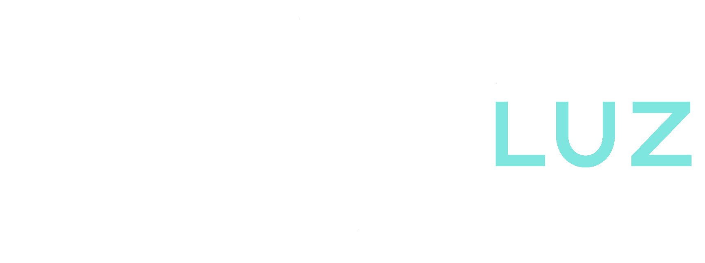
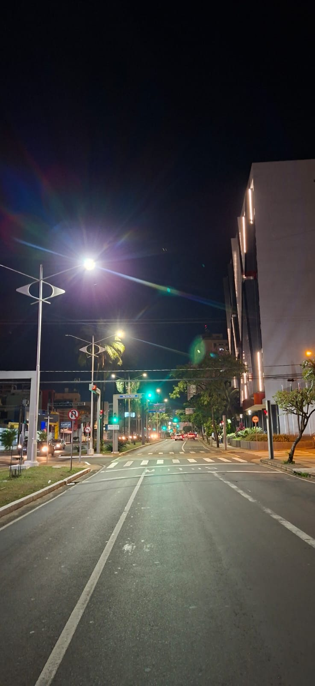
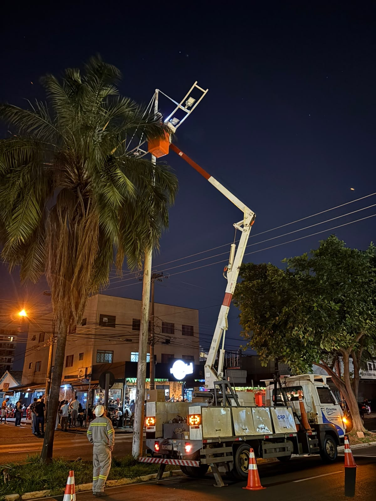
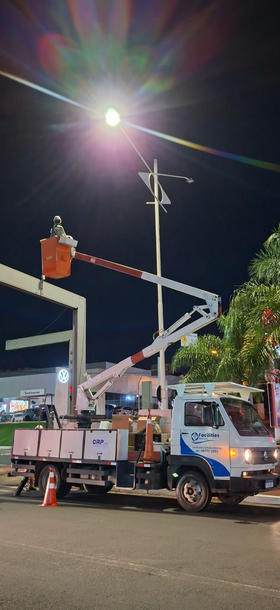
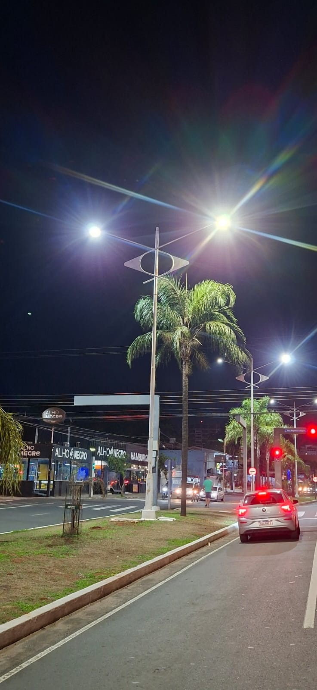

# CRP Luz — Código-Fonte Completo e Estrutura do Projeto

Documento consolidado contendo todo o código-fonte, configurações de infraestrutura e inventário de assets da landing page institucional da **CRP Luz (Companhia Rio Preto Luz)** / **Smart Rio Preto**.

---

## 📁 Estrutura de Arquivos e Assets

```text
crp-luz/
├── _headers                   # Regras de segurança (CSP, HSTS, X-Frame) e Cache-Control
├── robots.txt                 # Instruções de rastreamento para buscadores
├── index.html                 # Código completo da landing page (HTML5 + CSS3 + JS Vanilla)
├── README.md                  # Documentação operacional e guia de produção
└── assets/                    # Assets estáticos otimizados (3.55 MB total)
    ├── hero-poster.jpg
    ├── hero.mp4
    ├── hero_crpluz.mp4
    ├── logo-light.png
    ├── logo.png
    ├── slide-1.jpg
    ├── slide-2.jpg
    ├── slide-3.jpg
    ├── slide-4.jpg
```

### Inventário Detalhado dos Assets (`assets/`):
- `hero-poster.jpg` (39,195 bytes / 0.04 MB)
- `hero.mp4` (1,267,798 bytes / 1.21 MB)
- `hero_crpluz.mp4` (1,267,798 bytes / 1.21 MB)
- `logo-light.png` (66,939 bytes / 0.06 MB)
- `logo.png` (137,194 bytes / 0.13 MB)
- `slide-1.jpg` (150,112 bytes / 0.14 MB)
- `slide-2.jpg` (188,482 bytes / 0.18 MB)
- `slide-3.jpg` (204,725 bytes / 0.20 MB)
- `slide-4.jpg` (401,394 bytes / 0.38 MB)

---

## 1. `_headers` (Cloudflare / Edge Security & Cache Headers)

```http
# Cloudflare Pages Security & Cache Headers

# Global rules for all document pages (HTML)
/*
  X-Frame-Options: DENY
  X-Content-Type-Options: nosniff
  Referrer-Policy: strict-origin-when-cross-origin
  Permissions-Policy: camera=(), microphone=(), geolocation=(), browsing-topics=()
  Strict-Transport-Security: max-age=31536000; includeSubDomains; preload
  Content-Security-Policy: default-src 'self'; script-src 'self' 'unsafe-inline'; style-src 'self' 'unsafe-inline' https://fonts.googleapis.com; font-src https://fonts.gstatic.com; img-src 'self' data:; media-src 'self'; connect-src 'self'; object-src 'none'; base-uri 'self'; form-action 'self'; frame-ancestors 'none'; upgrade-insecure-requests;
  Cache-Control: public, max-age=0, must-revalidate

# Cache rules for static assets (images, video, fonts)
/assets/*
  Cache-Control: public, max-age=86400, stale-while-revalidate=604800
```

---

## 2. `robots.txt`

```text
User-agent: *
Allow: /
```

---

## 3. `README.md`

```markdown
# CRP Luz — Landing Page Institucional

Landing page oficial e institucional da **CRP Luz (Companhia Rio Preto Luz)**, concessionária responsável pela modernização, expansão e manutenção do parque de iluminação pública de São José do Rio Preto — SP.

O projeto foi construído e otimizado para alta performance, baixo custo operacional, segurança de borda e total resiliência a picos de tráfego.

---

## 🏛️ Arquitetura de Produção

A aplicação é **100% estática (JAMstack puro)**, eliminando servidores de aplicação, bancos de dados e superfícies de ataque dinâmicas.

```text
[ Usuário Final ]
       │  (HTTPS / HTTP/3)
       ▼
[ Cloudflare Edge / CDN Global ]
   ├── DNS Gerenciado (Proxy Ativo: Nuvem Laranja)
   ├── Proteção DDoS & Bot Management (Bot Fight Mode)
   ├── Web Application Firewall (WAF)
   ├── SSL/TLS Full (Strict) + HSTS
   └── Edge Cache (Regras em _headers)
       │  (Zero Roundtrip para Cache Hit)
       ▼
[ Cloudflare Pages Storage ]
   └── Arquivos Estáticos Pré-renderizados (HTML, CSS, JS, Imagens, Vídeo)
```

### Principais Benefícios:
1. **Pico de Acesso Ilimitado:** As requisições são servidas a partir dos mais de 300 data centers da Cloudflare no mundo, sem sobrecarregar servidores de origem.
2. **Custo Operacional Zero / Quase Zero:** Cloudflare Pages oferece banda e requests ilimitados no plano gratuito/básico.
3. **Resiliência Máxima:** Sem processos Node.js, PHP ou bancos de dados para travar ou cair sob carga.
4. **Segurança por Padrão:** Headers de segurança restritivos e superfícies de ataque nulas.

---

## 📁 Estrutura do Projeto

```text
crp-luz/
├── _headers                   # Regras de segurança (CSP, HSTS, X-Frame) e Cache-Control para Cloudflare Pages
├── robots.txt                 # Instruções de rastreamento para buscadores
├── index.html                 # Landing page única e semântica com CSS/JS vanilla inlined
├── README.md                  # Documentação operacional de engenharia
└── assets/
    ├── hero_crpluz.mp4        # Vídeo oficial em alta definição no Hero (1.2 MB otimizado)
    ├── hero-poster.jpg        # Poster instantâneo de carregamento (39 KB)
    ├── logo-light.png         # Logotipo oficial em versão de alto contraste (66 KB)
    ├── slide-1.jpg            # Fotografia operacional: Avenida iluminada
    ├── slide-2.jpg            # Fotografia operacional: Frota e caminhão
    ├── slide-3.jpg            # Fotografia operacional: Corredor viário arborizado
    └── slide-4.jpg            # Fotografia operacional: Equipe técnica noturna
```

---

## 🛠️ Como Executar Localmente

O projeto não requer `npm`, `node_modules` ou compilação.

### Opção 1: Python 3
```bash
python -m http.server 8080
```
Acesse: [http://localhost:8080](http://localhost:8080)

### Opção 2: Node.js (se disponível)
```bash
npx serve .
```

### Opção 3: Direto no Navegador
Você pode abrir o arquivo `index.html` diretamente em qualquer navegador moderno com dois cliques.

---

## 🚀 Publicação em Produção (Cloudflare Pages)

### 1. Conexão com o Repositório Git (Recomendado)
1. Acesse o **Cloudflare Dashboard** ([dash.cloudflare.com](https://dash.cloudflare.com/)).
2. No menu lateral, navegue até **Workers & Pages** > **Create application** > **Pages** > **Connect to Git**.
3. Selecione o repositório `crp-luz` (ex: `TheyDreez/crp-luz`).
4. Configure o build:
   - **Framework preset:** `None`
   - **Build command:** *(deixar vazio)*
   - **Build output directory:** `.` (ou `/`)
   - **Production branch:** `main`
5. Clique em **Save and Deploy**. Em menos de 30 segundos o projeto estará publicado com uma URL `.pages.dev`.

### 2. Configuração de Domínio Personalizado
1. No projeto Pages, acesse a aba **Custom domains**.
2. Clique em **Set up a custom domain**.
3. Insira o domínio oficial (ex: `crpluz.com.br` e `www.crpluz.com.br`).
4. O Cloudflare cuidará automaticamente do apontamento de DNS e da emissão dos certificados SSL/TLS universais.

---

## 🛡️ Configurações Recomendadas no Cloudflare Dashboard

Para garantir a máxima segurança, velocidade e absorção de picos:

### 1. DNS
- Certifique-se de que os registros `A` / `CNAME` do domínio estejam com o **Proxy Status: Proxied (Nuvem Laranja ativada)**. Isso garante que todo o tráfego passe pelos escudos da Cloudflare.

### 2. SSL/TLS
- **Encryption Mode:** `Full (Strict)`
- **Always Use HTTPS:** `Enabled` (Ativo)
- **Minimum TLS Version:** `TLS 1.2`
- **Automatic HTTPS Rewrites:** `Enabled` (Ativo)
- **HTTP/3 (with QUIC):** `Enabled` (Ativo)

### 3. WAF & Segurança
- **Security Level:** `Medium` (ou `High` durante grandes campanhas na TV/rádio).
- **Bot Fight Mode:** `Enabled` (Bloqueia requisições abusivas de bots conhecidos e scrapers maliciosos).
- **Rate Limiting:** Como o site é totalmente estático e servido pelo cache de borda, **não é necessário** configurar rate limiting agressivo pago. Se desejar, crie uma regra gratuita no WAF limitando acessos por IP que excedam 300 requisições/minuto.

### 4. Otimização de Performance
- **Early Hints:** `Enabled`
- **Brotli:** `Enabled`
- **Auto Minify:** Desativado (o código já está otimizado e minificado no HTML original).

---

## 🔒 Headers de Segurança e Cache (`_headers`)

O arquivo `_headers` na raiz do projeto é interpretado nativamente pelo Cloudflare Pages:

| Header | Valor | Finalidade |
| :--- | :--- | :--- |
| `Strict-Transport-Security` | `max-age=31536000; includeSubDomains; preload` | Força conexões HTTPS por 1 ano |
| `X-Frame-Options` | `DENY` | Impede ataques de Clickjacking / embedding em iframes |
| `X-Content-Type-Options` | `nosniff` | Previne MIME-sniffing malicioso |
| `Referrer-Policy` | `strict-origin-when-cross-origin` | Protege metadados de navegação |
| `Permissions-Policy` | `camera=(), microphone=(), geolocation=(), browsing-topics=()` | Desativa recursos desnecessários do navegador |
| `Content-Security-Policy` | `default-src 'self'; script-src 'self' 'unsafe-inline'; style-src 'self' 'unsafe-inline' https://fonts.googleapis.com; font-src https://fonts.gstatic.com; img-src 'self' data:; media-src 'self';` | Bloqueia injeção de scripts e recursos de terceiros não autorizados |
| `Cache-Control` (HTML) | `public, max-age=0, must-revalidate` | Permite atualizações imediatas no browser dos usuários |
| `Cache-Control` (Assets) | `public, max-age=86400, stale-while-revalidate=604800` | Armazena assets estáticos em cache na borda (CDN) e no navegador |

### Como Validar os Headers via Terminal
```bash
curl -I https://www.crpluz.com.br
```
Verifique a presença dos headers `Strict-Transport-Security`, `Content-Security-Policy` e `cf-cache-status: HIT`.

---

## 🔄 Fluxo de Atualização Contínua

Qualquer alteração feita na branch `main` dispara um deploy atômico e instantâneo no Cloudflare Pages:

```bash
# 1. Faça as modificações necessárias
git add .
git commit -m "docs: atualização das diretrizes de iluminação"

# 2. Envie para o GitHub
git push origin main
```
Em cerca de 15 a 30 segundos, a nova versão estará no ar globalmente sem tempo de inatividade (*zero-downtime*).

---

## ⏪ Rollback Imediato (Zero-Downtime)

Se alguma publicação introduzir um problema:
1. No painel do **Cloudflare Pages**, clique no projeto `crp-luz`.
2. Acesse a aba **Deployments**.
3. Localize o deploy estável anterior na lista.
4. Clique nos três pontinhos `...` ao lado do deploy e selecione **Rollback to this deployment**.
5. O tráfego global é redirecionado instantaneamente (em menos de 2 segundos) para a versão estável anterior.

---

## ✅ Checklist Pré e Pós-Deploy

### Pré-Deploy:
- [x] Ausência de bibliotecas pesadas ou dependências dinâmicas no client.
- [x] Otimização de assets: vídeo do hero e imagens pesam menos de 4 MB somados.
- [x] Arquivo `_headers` presente com regras de segurança e cache.
- [x] Arquivo `robots.txt` presente permitindo indexação correta.
- [x] Teste de carregamento e reprodução de vídeo em desktop e mobile.
- [x] Validação de links de atendimento telefônico (`tel:08009214477`).

### Pós-Deploy:
- [ ] Validar status do SSL/TLS no navegador (cadeado verde/seguro).
- [ ] Conferir headers de resposta HTTP via `curl -I` ou DevTools.
- [ ] Verificar reprodução suave do vídeo hero e presença do poster de fallback.
- [ ] Testar navegação em dispositivo móvel real sob conexão 4G.
- [ ] Confirmar ativação do **Bot Fight Mode** e **Full (Strict)** no painel Cloudflare.
```

---

## 4. `index.html` (Aplicação Completa: HTML5 + CSS3 + JS Vanilla)

```html
<!DOCTYPE html>
<html lang="pt-BR">
<head>
<meta charset="UTF-8" />
<meta name="viewport" content="width=device-width, initial-scale=1.0" />
<title>CRP Luz — 0800 921 4477 | Iluminação Pública de São José do Rio Preto</title>
<meta name="description" content="CRP Luz — Iluminação pública de São José do Rio Preto. Telefone oficial: 0800 921 4477." />
<meta name="theme-color" content="#071326" />
<link rel="canonical" href="https://www.crpluz.com.br/" />

<!-- Open Graph / Facebook -->
<meta property="og:type" content="website" />
<meta property="og:url" content="https://www.crpluz.com.br/" />
<meta property="og:title" content="CRP Luz — 0800 921 4477 | Iluminação Pública de São José do Rio Preto" />
<meta property="og:description" content="CRP Luz — Iluminação pública de São José do Rio Preto. Telefone oficial: 0800 921 4477." />
<meta property="og:image" content="https://www.crpluz.com.br/assets/hero-poster.jpg" />
<meta property="og:locale" content="pt_BR" />

<!-- Twitter Card -->
<meta name="twitter:card" content="summary_large_image" />
<meta name="twitter:title" content="CRP Luz — 0800 921 4477 | Iluminação Pública de São José do Rio Preto" />
<meta name="twitter:description" content="CRP Luz — Iluminação pública de São José do Rio Preto. Telefone oficial: 0800 921 4477." />
<meta name="twitter:image" content="https://www.crpluz.com.br/assets/hero-poster.jpg" />
<link rel="icon" href="data:image/svg+xml,%3Csvg xmlns='http://www.w3.org/2000/svg' viewBox='0 0 32 32'%3E%3Crect width='32' height='32' rx='7' fill='%230B1B36'/%3E%3Ctext x='6' y='22' font-family='Arial' font-size='15' font-weight='800' fill='%235A9BE6'%3EC%3C/text%3E%3Ctext x='17' y='22' font-family='Arial' font-size='15' font-weight='800' fill='%237FE6DF'%3EL%3C/text%3E%3C/svg%3E" />
<link rel="preconnect" href="https://fonts.googleapis.com" />
<link rel="preconnect" href="https://fonts.gstatic.com" crossorigin />
<link href="https://fonts.googleapis.com/css2?family=Sora:wght@400;600;700;800&family=Inter:wght@400;500;600&display=swap" rel="stylesheet" />
<style>
:root {
  --blue-brand: #2D5698;
  --blue-deep: #163666;
  --navy-dark: #0A182F;
  --navy-abyss: #060F1E;
  --teal-bright: #7FE6DF;
  --teal-primary: #249591;
  --ink-body: #1E2D42;
  --ink-subtle: #5A6D88;
  --ink-light: #94A3B8;
  --bg-page: #060F1E;
  --bg-surface: #FFFFFF;
  --bg-subtle: #F8FAFC;
  --border-glass: rgba(255, 255, 255, 0.12);
  --border-light: #E2E8F0;
  --header-h: 72px;
  --max-w: 1200px;
  --font-display: "Sora", sans-serif;
  --font-body: "Inter", -apple-system, BlinkMacSystemFont, "Segoe UI", Roboto, sans-serif;
  --focus-ring: #7FE6DF;
}

*, *::before, *::after {
  box-sizing: border-box;
}

html {
  scroll-behavior: smooth;
  -webkit-text-size-adjust: 100%;
}

body {
  margin: 0;
  padding: 0;
  font-family: var(--font-body);
  background-color: var(--bg-page);
  color: #FFFFFF;
  line-height: 1.6;
  -webkit-font-smoothing: antialiased;
  overflow-x: hidden;
}

h1, h2, h3 {
  font-family: var(--font-display);
  margin: 0;
}

a {
  color: inherit;
  text-decoration: none;
}

a:focus-visible, button:focus-visible {
  outline: 3px solid var(--focus-ring);
  outline-offset: 3px;
  border-radius: 8px;
}

.skip-link {
  position: absolute;
  left: -9999px;
  top: 12px;
  z-index: 999;
  background: #FFFFFF;
  color: var(--blue-brand);
  padding: 12px 20px;
  font-weight: 700;
  border-radius: 8px;
  box-shadow: 0 8px 24px rgba(0,0,0,0.3);
}
.skip-link:focus {
  left: 24px;
}

.wrap {
  width: 100%;
  max-width: var(--max-w);
  margin: 0 auto;
  padding: 0 28px;
}

/* ==================================================
   LIGHT CURSOR (Desktop com pointer fine)
   ================================================== */
.light-cursor {
  position: fixed;
  top: 0;
  left: 0;
  width: 440px;
  height: 440px;
  border-radius: 50%;
  pointer-events: none;
  z-index: 90;
  transform: translate3d(-50%, -50%, 0);
  opacity: 0;
  background: radial-gradient(
    circle,
    rgba(127, 230, 223, 0.16) 0%,
    rgba(45, 86, 152, 0.10) 35%,
    rgba(6, 15, 30, 0) 70%
  );
  filter: blur(8px);
  transition: opacity 0.4s ease, width 0.3s ease, height 0.3s ease;
  will-change: transform, opacity;
}
.light-cursor.active {
  opacity: 1;
}
.light-cursor.hovering {
  width: 580px;
  height: 580px;
  background: radial-gradient(
    circle,
    rgba(127, 230, 223, 0.24) 0%,
    rgba(45, 86, 152, 0.14) 40%,
    rgba(6, 15, 30, 0) 70%
  );
}

/* ==================================================
   HEADER (Discreto, minimalista e equilibrado)
   ================================================== */
.site-header {
  position: fixed;
  top: 0;
  left: 0;
  right: 0;
  height: var(--header-h);
  z-index: 80;
  display: flex;
  align-items: center;
  background: linear-gradient(180deg, rgba(6, 15, 30, 0.85) 0%, rgba(6, 15, 30, 0.4) 100%);
  backdrop-filter: blur(12px);
  -webkit-backdrop-filter: blur(12px);
  border-bottom: 1px solid var(--border-glass);
  transition: background 0.3s ease, border-color 0.3s ease, box-shadow 0.3s ease;
}

.site-header .wrap {
  display: flex;
  align-items: center;
  justify-content: space-between;
  gap: 20px;
}

.header-brand {
  display: inline-flex;
  align-items: center;
  opacity: 0;
  transform: translateY(-4px);
  pointer-events: none;
  transition: opacity 0.3s ease, transform 0.3s ease;
}
.header-brand img {
  height: 26px;
  width: auto;
  display: block;
}
.site-header.scrolled .header-brand {
  opacity: 1;
  transform: translateY(0);
  pointer-events: auto;
}

.header-phone {
  display: inline-flex;
  align-items: center;
  gap: 8px;
  padding: 8px 18px;
  background: rgba(255, 255, 255, 0.08);
  border: 1px solid rgba(255, 255, 255, 0.18);
  border-radius: 999px;
  font-family: var(--font-display);
  font-size: 14px;
  font-weight: 700;
  color: #FFFFFF;
  letter-spacing: -0.01em;
  backdrop-filter: blur(8px);
  transition: background 0.2s ease, border-color 0.2s ease, color 0.2s ease;
}
.header-phone svg {
  width: 15px;
  height: 15px;
  color: var(--teal-bright);
}
.header-phone:hover {
  background: rgba(255, 255, 255, 0.15);
  border-color: var(--teal-bright);
  color: var(--teal-bright);
}

/* ==================================================
   HERO COM VÍDEO REAL DA OPERAÇÃO
   ================================================== */
.hero {
  position: relative;
  min-height: 92vh;
  display: flex;
  align-items: center;
  overflow: hidden;
  isolation: isolate;
  padding-top: calc(var(--header-h) + 20px);
  padding-bottom: 70px;
}

.hero-video-wrap {
  position: absolute;
  inset: -10px;
  z-index: 0;
  overflow: hidden;
  will-change: transform;
}

.hero-video {
  width: 100%;
  height: 100%;
  object-fit: cover;
  object-position: center;
  transform: scale(1.04);
  transition: transform 0.2s ease-out;
}

/* Overlay cinematográfico refinado: preserva a operação sem desfoque */
.hero-overlay {
  position: absolute;
  inset: 0;
  z-index: 1;
  pointer-events: none;
  background:
    linear-gradient(180deg, rgba(6, 15, 30, 0.72) 0%, rgba(6, 15, 30, 0.45) 45%, rgba(6, 15, 30, 0.88) 100%),
    radial-gradient(ellipse at 25% 45%, rgba(10, 24, 47, 0.65) 0%, transparent 75%),
    radial-gradient(circle at 80% 20%, rgba(36, 149, 145, 0.22) 0%, transparent 60%);
}

.hero .wrap {
  position: relative;
  z-index: 2;
  display: flex;
  flex-direction: column;
  align-items: flex-start;
  max-width: 800px;
}

.hero-tag {
  display: inline-flex;
  align-items: center;
  gap: 10px;
  font-size: 13px;
  font-weight: 600;
  letter-spacing: 0.12em;
  text-transform: uppercase;
  color: var(--teal-bright);
  background: rgba(6, 15, 30, 0.6);
  border: 1px solid rgba(127, 230, 223, 0.3);
  padding: 8px 18px;
  border-radius: 999px;
  backdrop-filter: blur(8px);
  margin-bottom: 24px;
}
.hero-tag-dot {
  width: 8px;
  height: 8px;
  border-radius: 50%;
  background: var(--teal-bright);
  box-shadow: 0 0 10px var(--teal-bright);
  display: inline-block;
  animation: pulse-dot 2.4s infinite ease-in-out;
}
@keyframes pulse-dot {
  0%, 100% { transform: scale(1); opacity: 0.9; }
  50% { transform: scale(1.3); opacity: 1; }
}

.sr-only {
  position: absolute;
  width: 1px;
  height: 1px;
  padding: 0;
  margin: -1px;
  overflow: hidden;
  clip: rect(0, 0, 0, 0);
  white-space: nowrap;
  border-width: 0;
}

.hero-brand-title {
  position: relative;
  display: inline-block;
  margin: 0 0 24px 0;
  line-height: 1;
}

/* Luz de fundo atmosférica (Aura suave de iluminação urbana) */
.hero-brand-title::before {
  content: "";
  position: absolute;
  top: 50%;
  left: 50%;
  transform: translate(-50%, -50%);
  width: 150%;
  height: 200%;
  border-radius: 50%;
  background: radial-gradient(
    ellipse at center,
    rgba(127, 230, 223, 0.28) 0%,
    rgba(45, 86, 152, 0.22) 42%,
    rgba(6, 15, 30, 0) 75%
  );
  filter: blur(28px);
  pointer-events: none;
  z-index: 0;
}

.hero-brand-logo {
  position: relative;
  z-index: 1;
  height: clamp(64px, 10.5vw, 104px);
  width: auto;
  max-width: 100%;
  display: block;
  filter:
    drop-shadow(0 0 32px rgba(127, 230, 223, 0.32))
    drop-shadow(0 6px 28px rgba(0, 0, 0, 0.8));
}

.hero h1 {
  font-size: clamp(3.2rem, 7.5vw, 5.8rem);
  font-weight: 800;
  line-height: 0.98;
  letter-spacing: -0.035em;
  color: #FFFFFF;
  margin-bottom: 20px;
  text-shadow: 0 4px 30px rgba(0, 0, 0, 0.6);
}

.hero-construction {
  display: inline-block;
  font-family: var(--font-display);
  font-size: clamp(1.25rem, 2.5vw, 1.65rem);
  font-weight: 700;
  letter-spacing: -0.015em;
  color: #E2E8F0;
  margin-bottom: 16px;
  text-shadow: 0 2px 14px rgba(0, 0, 0, 0.5);
}

.hero-desc {
  font-size: clamp(1.05rem, 1.8vw, 1.22rem);
  color: #CBD5E1;
  max-width: 620px;
  line-height: 1.65;
  margin-bottom: 36px;
  text-shadow: 0 2px 10px rgba(0, 0, 0, 0.5);
}

.hero-scroll-cue {
  display: inline-flex;
  align-items: center;
  gap: 10px;
  font-size: 13px;
  font-weight: 600;
  letter-spacing: 0.08em;
  text-transform: uppercase;
  color: #94A3B8;
  transition: color 0.2s ease, transform 0.2s ease;
}
.hero-scroll-cue:hover {
  color: var(--teal-bright);
  transform: translateY(3px);
}
.hero-scroll-cue svg {
  width: 18px;
  height: 18px;
  animation: bounce-slow 2.2s infinite ease-in-out;
}
@keyframes bounce-slow {
  0%, 100% { transform: translateY(0); }
  50% { transform: translateY(6px); }
}

/* ==================================================
   BLOCO PRINCIPAL DE ATENDIMENTO (O 0800 É O PROTAGONISTA)
   ================================================== */
.atendimento-section {
  position: relative;
  z-index: 10;
  background: linear-gradient(180deg, #060F1E 0%, #0A1931 50%, #060F1E 100%);
  padding: 80px 0 90px;
  border-top: 1px solid rgba(127, 230, 223, 0.15);
  border-bottom: 1px solid rgba(255, 255, 255, 0.08);
  overflow: hidden;
}

/* Halo de luz urbana atrás do bloco */
.atendimento-section::before {
  content: "";
  position: absolute;
  top: 50%;
  left: 50%;
  transform: translate(-50%, -50%);
  width: 820px;
  height: 520px;
  background: radial-gradient(
    ellipse at center,
    rgba(127, 230, 223, 0.14) 0%,
    rgba(45, 86, 152, 0.18) 40%,
    rgba(6, 15, 30, 0) 70%
  );
  pointer-events: none;
  z-index: 1;
}

.atendimento-panel {
  position: relative;
  z-index: 2;
  max-width: 840px;
  margin: 0 auto;
  background: rgba(10, 25, 49, 0.85);
  border: 1px solid rgba(127, 230, 223, 0.35);
  border-radius: 28px;
  padding: 54px 50px;
  text-align: center;
  backdrop-filter: blur(20px);
  -webkit-backdrop-filter: blur(20px);
  box-shadow:
    0 30px 80px -20px rgba(0, 0, 0, 0.8),
    0 0 50px -10px rgba(36, 149, 145, 0.25);
}

.att-kicker {
  display: inline-block;
  font-family: var(--font-display);
  font-size: 13px;
  font-weight: 800;
  letter-spacing: 0.22em;
  text-transform: uppercase;
  color: var(--teal-bright);
  margin-bottom: 12px;
}

.att-title {
  font-size: clamp(1.35rem, 2.5vw, 1.85rem);
  font-weight: 700;
  letter-spacing: -0.02em;
  color: #FFFFFF;
  margin-bottom: 22px;
}

/* O NÚMERO COMO PRINCIPAL ELEMENTO TIPOGRÁFICO DA SEÇÃO */
.att-phone-box {
  margin-bottom: 30px;
}
.att-phone-num {
  display: inline-block;
  font-family: var(--font-display);
  font-size: clamp(3.6rem, 8.8vw, 5.6rem);
  font-weight: 800;
  line-height: 0.95;
  letter-spacing: -0.04em;
  color: #FFFFFF;
  text-shadow: 0 4px 25px rgba(127, 230, 223, 0.3);
  transition: transform 0.2s cubic-bezier(0.16, 1, 0.3, 1), color 0.2s ease;
}
.att-phone-num:hover {
  transform: scale(1.025);
  color: var(--teal-bright);
}

/* O BOTÃO TÁTIL DE CHAMADA */
.att-cta-btn {
  display: inline-flex;
  align-items: center;
  justify-content: center;
  gap: 14px;
  min-height: 64px;
  padding: 18px 46px;
  background: #FFFFFF;
  color: var(--navy-dark);
  font-family: var(--font-display);
  font-size: 1.18rem;
  font-weight: 800;
  border-radius: 16px;
  letter-spacing: -0.01em;
  box-shadow:
    0 16px 36px rgba(0, 0, 0, 0.45),
    0 0 0 1px rgba(255, 255, 255, 0.9) inset;
  transition:
    transform 0.18s cubic-bezier(0.16, 1, 0.3, 1),
    box-shadow 0.18s ease,
    background 0.18s ease,
    color 0.18s ease;
}
.att-cta-btn svg {
  width: 22px;
  height: 22px;
  color: var(--blue-brand);
  transition: transform 0.2s ease, color 0.2s ease;
}
.att-cta-btn:hover {
  transform: translateY(-2px);
  background: var(--teal-bright);
  color: var(--navy-abyss);
  box-shadow:
    0 22px 48px rgba(0, 0, 0, 0.6),
    0 0 24px rgba(127, 230, 223, 0.4);
}
.att-cta-btn:hover svg {
  color: var(--navy-abyss);
  transform: scale(1.08);
}

/* ==================================================
   COMPOSIÇÃO FOTOGRÁFICA EDITORIAL (Operação Real)
   ================================================== */
.operacao-section {
  position: relative;
  background: #FFFFFF;
  color: var(--ink-body);
  padding: 100px 0 110px;
}

.operacao-head {
  display: flex;
  align-items: flex-end;
  justify-content: space-between;
  gap: 24px;
  margin-bottom: 40px;
}

.operacao-kicker {
  font-size: 12px;
  font-weight: 800;
  letter-spacing: 0.18em;
  text-transform: uppercase;
  color: var(--teal-primary);
  margin-bottom: 8px;
}

.operacao-title {
  font-size: clamp(1.8rem, 3.2vw, 2.4rem);
  font-weight: 800;
  letter-spacing: -0.025em;
  color: var(--navy-dark);
}

.operacao-loc {
  display: inline-flex;
  align-items: center;
  gap: 8px;
  font-size: 14px;
  font-weight: 600;
  color: var(--ink-subtle);
  white-space: nowrap;
}
.operacao-loc svg {
  width: 18px;
  height: 18px;
  color: var(--teal-primary);
}

/* GRID EDITORIAL ASSIMÉTRICO */
.editorial-grid {
  display: grid;
  grid-template-columns: 1.4fr 1fr;
  grid-template-rows: auto auto;
  gap: 24px;
}

.editorial-card {
  position: relative;
  border-radius: 20px;
  overflow: hidden;
  background: var(--navy-dark);
  box-shadow: 0 16px 40px -12px rgba(10, 24, 47, 0.18);
  transition: transform 0.24s ease, box-shadow 0.24s ease;
}
.editorial-card:hover {
  transform: translateY(-4px);
  box-shadow: 0 24px 50px -10px rgba(10, 24, 47, 0.26);
}

.editorial-card img {
  width: 100%;
  height: 100%;
  object-fit: cover;
  display: block;
  transition: transform 0.4s ease;
}
.editorial-card:hover img {
  transform: scale(1.025);
}

.editorial-card::after {
  content: "";
  position: absolute;
  inset: 0;
  pointer-events: none;
  background: linear-gradient(180deg, transparent 55%, rgba(6, 15, 30, 0.65) 100%);
}

.card-label {
  position: absolute;
  left: 20px;
  bottom: 20px;
  z-index: 2;
  display: inline-flex;
  align-items: center;
  gap: 8px;
  font-size: 13px;
  font-weight: 600;
  color: #FFFFFF;
  background: rgba(6, 15, 30, 0.65);
  backdrop-filter: blur(8px);
  -webkit-backdrop-filter: blur(8px);
  border: 1px solid rgba(255, 255, 255, 0.16);
  padding: 8px 16px;
  border-radius: 999px;
}
.card-label svg {
  width: 14px;
  height: 14px;
  color: var(--teal-bright);
}

/* Posicionamento do Grid */
.card-featured {
  grid-row: 1 / span 2;
  min-height: 520px;
}

.card-side-top {
  min-height: 248px;
}

.card-side-bottom {
  min-height: 248px;
}

.card-wide-bottom {
  grid-column: 1 / span 2;
  height: 320px;
}

/* ==================================================
   FOOTER INSTITUCIONAL E SÓBRIO
   ================================================== */
.site-footer {
  background: var(--navy-abyss);
  border-top: 1px solid var(--border-glass);
  padding: 40px 0;
  color: var(--ink-light);
}

.site-footer .wrap {
  display: flex;
  align-items: center;
  justify-content: space-between;
  gap: 24px;
  flex-wrap: wrap;
}

.footer-brand {
  display: inline-flex;
  align-items: center;
}
.footer-brand img {
  height: 28px;
  width: auto;
  display: block;
}

.footer-meta {
  display: flex;
  align-items: center;
  gap: 24px;
  font-size: 14px;
  flex-wrap: wrap;
}

.footer-phone-link {
  color: #FFFFFF;
  font-family: var(--font-display);
  font-weight: 700;
  transition: color 0.2s ease;
}
.footer-phone-link:hover {
  color: var(--teal-bright);
}

/* ==================================================
   RESPONSIVIDADE (Tablets e Smartphones)
   ================================================== */
@media (max-width: 960px) {
  .editorial-grid {
    grid-template-columns: 1fr;
    grid-template-rows: auto;
  }
  .card-featured {
    grid-row: auto;
    min-height: 380px;
  }
  .card-wide-bottom {
    grid-column: auto;
    height: 280px;
  }
  .atendimento-panel {
    padding: 44px 30px;
  }
}

@media (max-width: 640px) {
  :root {
    --header-h: 66px;
  }
  .hero {
    min-height: 86vh;
    padding-top: calc(var(--header-h) + 16px);
    padding-bottom: 50px;
  }
  .hero h1 {
    font-size: 2.8rem;
  }
  .hero-tag {
    font-size: 11px;
    letter-spacing: 0.08em;
    padding: 6px 14px;
    margin-bottom: 18px;
  }
  .atendimento-section {
    padding: 60px 0 70px;
  }
  .atendimento-panel {
    padding: 36px 20px;
    border-radius: 22px;
  }
  .att-title {
    font-size: 1.25rem;
    margin-bottom: 16px;
  }
  .att-phone-num {
    font-size: clamp(1.95rem, 8vw, 2.75rem);
    white-space: nowrap;
  }
  .att-cta-btn {
    width: 100%;
    padding: 16px 24px;
    font-size: 1.05rem;
  }
  .operacao-section {
    padding: 70px 0 80px;
  }
  .operacao-head {
    flex-direction: column;
    align-items: flex-start;
    gap: 8px;
    margin-bottom: 28px;
  }
  .card-featured {
    min-height: 300px;
  }
  .card-side-top, .card-side-bottom, .card-wide-bottom {
    min-height: 220px;
    height: 220px;
  }
  .site-footer .wrap {
    flex-direction: column;
    align-items: center;
    text-align: center;
    gap: 16px;
  }
  .footer-meta {
    justify-content: center;
    gap: 16px;
  }
}

/* ==================================================
   REDUCED MOTION E TOUCH
   ================================================== */
@media (hover: none), (pointer: coarse) {
  .light-cursor {
    display: none !important;
  }
}

@media (prefers-reduced-motion: reduce) {
  html {
    scroll-behavior: auto;
  }
  *, *::before, *::after {
    animation: none !important;
    transition: none !important;
  }
  .light-cursor {
    display: none !important;
  }
  .hero-video {
    transform: none !important;
  }
}
</style>
</head>
<body>

<!-- Halo luminoso que acompanha o cursor (Desktop) -->
<div class="light-cursor" id="lightCursor" aria-hidden="true"></div>

<a class="skip-link" href="#atendimento">Pular para o atendimento</a>

<!-- ==================================================
     HEADER (Discreto: Logo à esquerda, 0800 à direita)
     ================================================== -->
<header class="site-header" id="siteHeader">
  <div class="wrap">
    <a class="header-brand" href="/" aria-label="CRP Luz — Página inicial" id="headerBrand">
      
    </a>
    <a class="header-phone" href="tel:08009214477" aria-label="Ligar para 0800 921 4477">
      <svg viewBox="0 0 24 24" fill="currentColor" aria-hidden="true">
        <path d="M6.6 10.8a15 15 0 0 0 6.6 6.6l2.2-2.2a1 1 0 0 1 1-.24 11.4 11.4 0 0 0 3.6.58 1 1 0 0 1 1 1V20a1 1 0 0 1-1 1A17 17 0 0 1 3 4a1 1 0 0 1 1-1h3.5a1 1 0 0 1 1 1c0 1.25.2 2.46.58 3.6a1 1 0 0 1-.25 1L6.6 10.8Z"/>
      </svg>
      <span>0800 921 4477</span>
    </a>
  </div>
</header>

<main id="mainContent">

  <!-- ==================================================
       HERO COM VÍDEO REAL DA OPERAÇÃO
       ================================================== -->
  <section class="hero" id="hero">
    <div class="hero-video-wrap" id="videoWrap">
      <video
        id="heroVideo"
        class="hero-video"
        autoplay
        muted
        loop
        playsinline
        preload="metadata"
        poster="assets/hero-poster.jpg"
        aria-label="Vídeo da operação real de iluminação pública da CRP Luz em São José do Rio Preto"
      >
        <source src="assets/hero_crpluz.mp4?v=crpluz" type="video/mp4" />
      </video>
    </div>
    
    <div class="hero-overlay" aria-hidden="true"></div>

    <div class="wrap">
      <span class="hero-tag">
        <span class="hero-tag-dot"></span>
        Iluminação pública de São José do Rio Preto
      </span>

      <h1 class="hero-brand-title">
        
        <span class="sr-only">CRP Luz</span>
      </h1>

      <p class="hero-construction">Nosso novo site está em construção.</p>

      <p class="hero-desc">
        Estamos preparando um novo canal digital para aproximar a CRP Luz da população de São José do Rio Preto. Em breve, você poderá encontrar aqui informações e serviços da companhia.
      </p>

      <a href="#atendimento" class="hero-scroll-cue" aria-label="Ir para a seção de atendimento">
        <span>Atendimento</span>
        <svg viewBox="0 0 24 24" fill="none" stroke="currentColor" stroke-width="2" stroke-linecap="round" stroke-linejoin="round" aria-hidden="true">
          <path d="M12 5v14M19 12l-7 7-7-7"/>
        </svg>
      </a>
    </div>
  </section>

  <!-- ==================================================
       BLOCO PRINCIPAL DE ATENDIMENTO (O 0800 PROTAGONISTA)
       ================================================== -->
  <section class="atendimento-section" id="atendimento" aria-label="Atendimento telefônico oficial">
    <div class="wrap">
      <div class="atendimento-panel">
        
        <span class="att-kicker">ATENDIMENTO</span>

        <h2 class="att-title">Precisa falar com a CRP Luz?</h2>

        <div class="att-phone-box">
          <a class="att-phone-num" href="tel:08009214477" aria-label="Ligar para o número 0800 921 4477">
            0800 921 4477
          </a>
        </div>

        <a class="att-cta-btn" href="tel:08009214477" aria-label="Ligar para a CRP Luz">
          <svg viewBox="0 0 24 24" fill="currentColor" aria-hidden="true">
            <path d="M6.6 10.8a15 15 0 0 0 6.6 6.6l2.2-2.2a1 1 0 0 1 1-.24 11.4 11.4 0 0 0 3.6.58 1 1 0 0 1 1 1V20a1 1 0 0 1-1 1A17 17 0 0 1 3 4a1 1 0 0 1 1-1h3.5a1 1 0 0 1 1 1c0 1.25.2 2.46.58 3.6a1 1 0 0 1-.25 1L6.6 10.8Z"/>
          </svg>
          <span>Ligar para a CRP Luz</span>
        </a>

      </div>
    </div>
  </section>

  <!-- ==================================================
       COMPOSIÇÃO FOTOGRÁFICA EDITORIAL (OPERAÇÃO REAL)
       ================================================== -->
  <section class="operacao-section" id="operacao" aria-label="Fotografias da operação real da CRP Luz">
    <div class="wrap">
      <div class="operacao-head">
        <div>
          <p class="operacao-kicker">Infraestrutura em Campo</p>
          <h2 class="operacao-title">Operação em São José do Rio Preto</h2>
        </div>
        <span class="operacao-loc">
          <svg viewBox="0 0 24 24" fill="none" stroke="currentColor" stroke-width="2" stroke-linecap="round" stroke-linejoin="round" aria-hidden="true">
            <path d="M12 21s-7-4.4-7-10a7 7 0 0 1 14 0c0 5.6-7 10-7 10Z"/>
            <circle cx="12" cy="11" r="2.5"/>
          </svg>
          São José do Rio Preto — SP
        </span>
      </div>

      <div class="editorial-grid">
        
        <!-- Foto Principal: Avenida iluminada -->
        <article class="editorial-card card-featured">
          
          <span class="card-label">
            <svg viewBox="0 0 24 24" fill="none" stroke="currentColor" stroke-width="2" aria-hidden="true"><circle cx="12" cy="12" r="9"/><path d="M12 3v18"/></svg>
            Vias e avenidas iluminadas
          </span>
        </article>

        <!-- Foto 2: Equipe técnica no cesto aéreo -->
        <article class="editorial-card card-side-top">
          
          <span class="card-label">
            <svg viewBox="0 0 24 24" fill="none" stroke="currentColor" stroke-width="2" aria-hidden="true"><path d="M14.7 6.3a1 1 0 0 0 0 1.4l1.6 1.6a1 1 0 0 0 1.4 0l3.77-3.77a6 6 0 0 1-7.94 7.94l-6.91 6.91a2.12 2.12 0 0 1-3-3l6.91-6.91a6 6 0 0 1 7.94-7.94l-3.76 3.76z"/></svg>
            Manutenção noturna
          </span>
        </article>

        <!-- Foto 3: Caminhão da frota -->
        <article class="editorial-card card-side-bottom">
          
          <span class="card-label">
            <svg viewBox="0 0 24 24" fill="none" stroke="currentColor" stroke-width="2" aria-hidden="true"><rect x="1" y="3" width="15" height="13"/><polygon points="16 8 20 8 23 11 23 16 16 16 16 8"/><circle cx="5.5" cy="18.5" r="2.5"/><circle cx="18.5" cy="18.5" r="2.5"/></svg>
            Frota de serviço
          </span>
        </article>

        <!-- Foto 4: Corredor urbano com postes estilizados -->
        <article class="editorial-card card-wide-bottom">
          
          <span class="card-label">
            <svg viewBox="0 0 24 24" fill="none" stroke="currentColor" stroke-width="2" aria-hidden="true"><path d="M12 21s-7-4.4-7-10a7 7 0 0 1 14 0c0 5.6-7 10-7 10Z"/></svg>
            São José do Rio Preto — SP
          </span>
        </article>

      </div>
    </div>
  </section>

</main>

<!-- ==================================================
     FOOTER INSTITUCIONAL E SÓBRIO
     ================================================== -->
<footer class="site-footer">
  <div class="wrap">
    <div class="footer-brand">
      
    </div>

    <div class="footer-meta">
      <span>São José do Rio Preto — SP</span>
      <a class="footer-phone-link" href="tel:08009214477" aria-label="Ligar para 0800 921 4477">0800 921 4477</a>
      <span>&copy; 2026 CRP Luz</span>
    </div>
  </div>
</footer>

<!-- ==================================================
     SCRIPTS: MICROINTERAÇÕES E PERFORMANCE
     ================================================== -->
<script>
(function() {
  'use strict';

  // 1. LIGHT CURSOR (Desktop pointer fine, respeita prefers-reduced-motion)
  const isFinePointer = window.matchMedia('(hover: hover) and (pointer: fine)').matches;
  const isReducedMotion = window.matchMedia('(prefers-reduced-motion: reduce)').matches;

  if (isFinePointer && !isReducedMotion) {
    const cursor = document.getElementById('lightCursor');
    let mouseX = 0, mouseY = 0;
    let currentX = 0, currentY = 0;
    let isMoving = false;

    window.addEventListener('pointermove', function(e) {
      mouseX = e.clientX;
      mouseY = e.clientY;
      if (!isMoving) {
        currentX = mouseX;
        currentY = mouseY;
        isMoving = true;
        cursor.classList.add('active');
      }
      const isOverInteractive = !!e.target.closest('a, button, input, .editorial-card');
      cursor.classList.toggle('hovering', isOverInteractive);
    }, { passive: true });

    document.addEventListener('mouseleave', function() {
      cursor.classList.remove('active');
    });

    function renderCursor() {
      if (isMoving) {
        currentX += (mouseX - currentX) * 0.15;
        currentY += (mouseY - currentY) * 0.15;
        cursor.style.transform = 'translate3d(' + currentX + 'px, ' + currentY + 'px, 0) translate(-50%, -50%)';
      }
      requestAnimationFrame(renderCursor);
    }
    requestAnimationFrame(renderCursor);
  }

  // 2. MICROPARALLAX DO VÍDEO (máximo 4-8px)
  if (!isReducedMotion) {
    const video = document.getElementById('heroVideo');
    if (video) {
      let targetTranslateY = 0;
      let currentTranslateY = 0;

      window.addEventListener('scroll', function() {
        const scrolled = window.pageYOffset;
        if (scrolled < window.innerHeight) {
          // Deslocamento sutil entre 0 e 8px
          targetTranslateY = (scrolled / window.innerHeight) * 8;
        }
      }, { passive: true });

      function renderParallax() {
        currentTranslateY += (targetTranslateY - currentTranslateY) * 0.1;
        video.style.transform = 'scale(1.04) translate3d(0, ' + currentTranslateY + 'px, 0)';
        requestAnimationFrame(renderParallax);
      }
      requestAnimationFrame(renderParallax);
    }
  }

  // 3. VÍDEO: Garantir reprodução e fallback seguro
  const heroVideo = document.getElementById('heroVideo');
  if (heroVideo) {
    const playPromise = heroVideo.play();
    if (playPromise !== undefined) {
      playPromise.catch(function() {
        // Autoplay bloqueado pelo navegador; o poster oficial permanecerá nítido
      });
    }
  }

  // 4. HEADER: Revelar logo discreta apenas após rolar o hero
  const siteHeader = document.getElementById('siteHeader');
  if (siteHeader) {
    window.addEventListener('scroll', function() {
      siteHeader.classList.toggle('scrolled', window.pageYOffset > 100);
    }, { passive: true });
  }
})();
</script>

</body>
</html>
```
