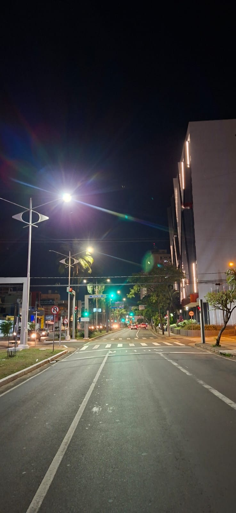
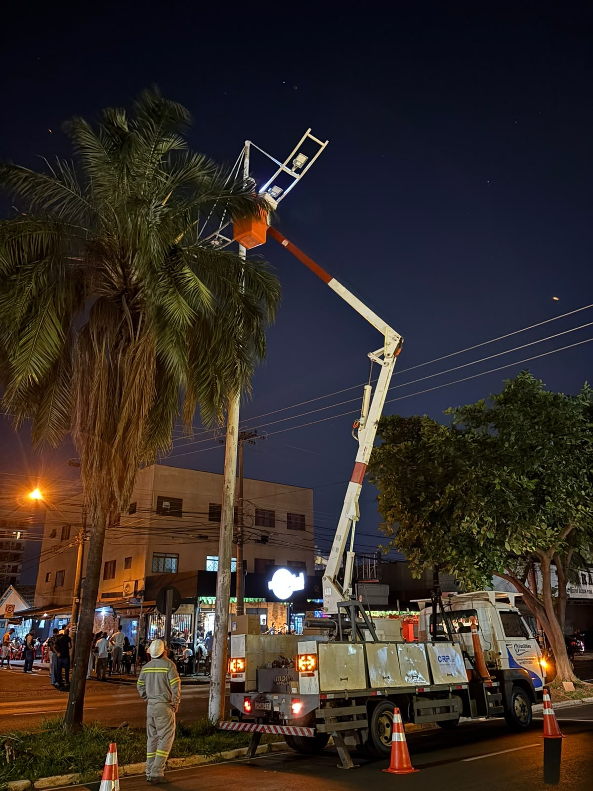
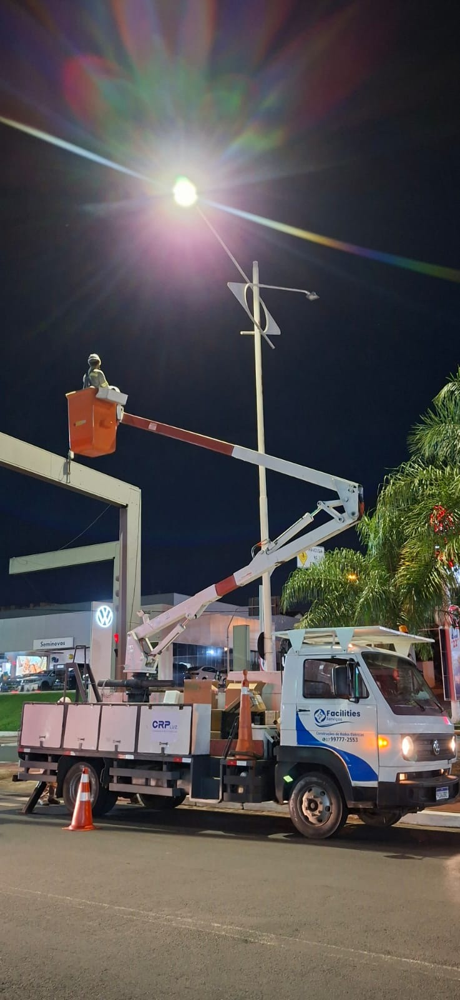
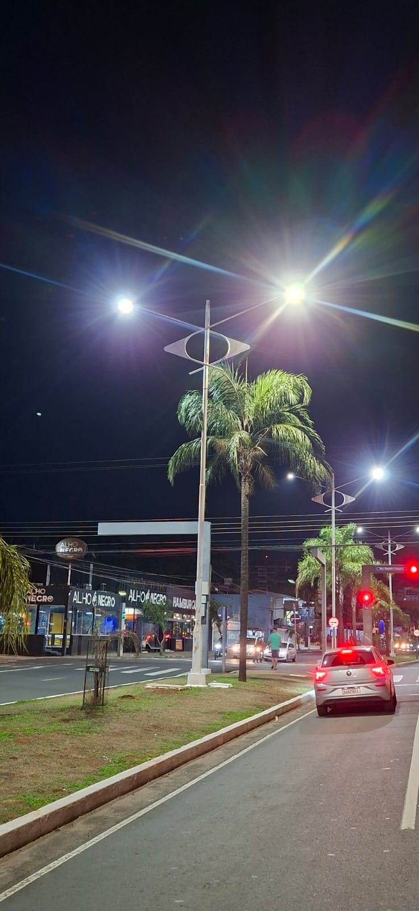

# CRP Luz — Código-Fonte Completo e Estrutura do Projeto

Documento consolidado contendo todo o código-fonte, configurações de infraestrutura e inventário de assets da landing page institucional da **CRP Luz (Companhia Rio Preto Luz)** / **Smart Rio Preto**.

---

## 📁 Estrutura de Arquivos e Assets

```text
crp-luz/
├── _headers                   # Regras de segurança (CSP, HSTS, X-Frame) e Cache-Control
├── robots.txt                 # Instruções de rastreamento para buscadores
├── index.html                 # Código completo da landing page (HTML5 + CSS3 + JS Vanilla)
├── README.md                  # Documentação operacional e guia de produção
└── assets/                    # Assets estáticos otimizados (3.55 MB total)
    ├── hero-poster.jpg
    ├── hero.mp4
    ├── hero_crpluz.mp4
    ├── logo-light.png
    ├── logo.png
    ├── operacao_avenida.mp4
    ├── slide-1.jpg
    ├── slide-2.jpg
    ├── slide-3.jpg
    ├── slide-4.jpg
```

### Inventário Detalhado dos Assets (`assets/`):
- `hero-poster.jpg` (100,115 bytes / 0.10 MB)
- `hero.mp4` (1,893,478 bytes / 1.81 MB)
- `hero_crpluz.mp4` (1,893,478 bytes / 1.81 MB)
- `logo-light.png` (66,939 bytes / 0.06 MB)
- `logo.png` (137,194 bytes / 0.13 MB)
- `operacao_avenida.mp4` (4,580,547 bytes / 4.37 MB)
- `slide-1.jpg` (150,112 bytes / 0.14 MB)
- `slide-2.jpg` (188,482 bytes / 0.18 MB)
- `slide-3.jpg` (204,725 bytes / 0.20 MB)
- `slide-4.jpg` (401,394 bytes / 0.38 MB)

---

## 1. `_headers` (Cloudflare / Edge Security & Cache Headers)

```http
# Cloudflare Pages Security & Cache Headers

# Global rules for all document pages (HTML)
/*
  X-Frame-Options: DENY
  X-Content-Type-Options: nosniff
  Referrer-Policy: strict-origin-when-cross-origin
  Permissions-Policy: camera=(), microphone=(), geolocation=(), browsing-topics=()
  Strict-Transport-Security: max-age=31536000; includeSubDomains; preload
  Content-Security-Policy: default-src 'self'; script-src 'self' 'unsafe-inline'; style-src 'self' 'unsafe-inline' https://fonts.googleapis.com; font-src https://fonts.gstatic.com; img-src 'self' data:; media-src 'self'; connect-src 'self'; object-src 'none'; base-uri 'self'; form-action 'self'; frame-ancestors 'none'; upgrade-insecure-requests;
  Cache-Control: public, max-age=0, must-revalidate

# Cache rules for static assets (images, video, fonts)
/assets/*
  Cache-Control: public, max-age=86400, stale-while-revalidate=604800
```

---

## 2. `robots.txt`

```text
User-agent: *
Allow: /
```

---

## 3. `README.md`

```markdown
# CRP Luz — Landing Page Institucional

Landing page oficial e institucional da **CRP Luz (Companhia Rio Preto Luz)**, concessionária responsável pela modernização, expansão e manutenção do parque de iluminação pública de São José do Rio Preto — SP.

O projeto foi construído e otimizado para alta performance, baixo custo operacional, segurança de borda e total resiliência a picos de tráfego.

---

## 🏛️ Arquitetura de Produção

A aplicação é **100% estática (JAMstack puro)**, eliminando servidores de aplicação, bancos de dados e superfícies de ataque dinâmicas.

```text
[ Usuário Final ]
       │  (HTTPS / HTTP/3)
       ▼
[ Cloudflare Edge / CDN Global ]
   ├── DNS Gerenciado (Proxy Ativo: Nuvem Laranja)
   ├── Proteção DDoS & Bot Management (Bot Fight Mode)
   ├── Web Application Firewall (WAF)
   ├── SSL/TLS Full (Strict) + HSTS
   └── Edge Cache (Regras em _headers)
       │  (Zero Roundtrip para Cache Hit)
       ▼
[ Cloudflare Pages Storage ]
   └── Arquivos Estáticos Pré-renderizados (HTML, CSS, JS, Imagens, Vídeo)
```

### Principais Benefícios:
1. **Pico de Acesso Ilimitado:** As requisições são servidas a partir dos mais de 300 data centers da Cloudflare no mundo, sem sobrecarregar servidores de origem.
2. **Custo Operacional Zero / Quase Zero:** Cloudflare Pages oferece banda e requests ilimitados no plano gratuito/básico.
3. **Resiliência Máxima:** Sem processos Node.js, PHP ou bancos de dados para travar ou cair sob carga.
4. **Segurança por Padrão:** Headers de segurança restritivos e superfícies de ataque nulas.

---

## 📁 Estrutura do Projeto

```text
crp-luz/
├── _headers                   # Regras de segurança (CSP, HSTS, X-Frame) e Cache-Control para Cloudflare Pages
├── robots.txt                 # Instruções de rastreamento para buscadores
├── index.html                 # Landing page única e semântica com CSS/JS vanilla inlined
├── README.md                  # Documentação operacional de engenharia
└── assets/
    ├── hero_crpluz.mp4        # Vídeo oficial em alta definição no Hero (1.2 MB otimizado)
    ├── hero-poster.jpg        # Poster instantâneo de carregamento (39 KB)
    ├── logo-light.png         # Logotipo oficial em versão de alto contraste (66 KB)
    ├── slide-1.jpg            # Fotografia operacional: Avenida iluminada
    ├── slide-2.jpg            # Fotografia operacional: Frota e caminhão
    ├── slide-3.jpg            # Fotografia operacional: Corredor viário arborizado
    └── slide-4.jpg            # Fotografia operacional: Equipe técnica noturna
```

---

## 🛠️ Como Executar Localmente

O projeto não requer `npm`, `node_modules` ou compilação.

### Opção 1: Python 3
```bash
python -m http.server 8080
```
Acesse: [http://localhost:8080](http://localhost:8080)

### Opção 2: Node.js (se disponível)
```bash
npx serve .
```

### Opção 3: Direto no Navegador
Você pode abrir o arquivo `index.html` diretamente em qualquer navegador moderno com dois cliques.

---

## 🚀 Publicação em Produção (Cloudflare Pages)

### 1. Conexão com o Repositório Git (Recomendado)
1. Acesse o **Cloudflare Dashboard** ([dash.cloudflare.com](https://dash.cloudflare.com/)).
2. No menu lateral, navegue até **Workers & Pages** > **Create application** > **Pages** > **Connect to Git**.
3. Selecione o repositório `crp-luz` (ex: `TheyDreez/crp-luz`).
4. Configure o build:
   - **Framework preset:** `None`
   - **Build command:** *(deixar vazio)*
   - **Build output directory:** `.` (ou `/`)
   - **Production branch:** `main`
5. Clique em **Save and Deploy**. Em menos de 30 segundos o projeto estará publicado com uma URL `.pages.dev`.

### 2. Configuração de Domínio Personalizado
1. No projeto Pages, acesse a aba **Custom domains**.
2. Clique em **Set up a custom domain**.
3. Insira o domínio oficial (ex: `crpluz.com.br` e `www.crpluz.com.br`).
4. O Cloudflare cuidará automaticamente do apontamento de DNS e da emissão dos certificados SSL/TLS universais.

---

## 🛡️ Configurações Recomendadas no Cloudflare Dashboard

Para garantir a máxima segurança, velocidade e absorção de picos:

### 1. DNS
- Certifique-se de que os registros `A` / `CNAME` do domínio estejam com o **Proxy Status: Proxied (Nuvem Laranja ativada)**. Isso garante que todo o tráfego passe pelos escudos da Cloudflare.

### 2. SSL/TLS
- **Encryption Mode:** `Full (Strict)`
- **Always Use HTTPS:** `Enabled` (Ativo)
- **Minimum TLS Version:** `TLS 1.2`
- **Automatic HTTPS Rewrites:** `Enabled` (Ativo)
- **HTTP/3 (with QUIC):** `Enabled` (Ativo)

### 3. WAF & Segurança
- **Security Level:** `Medium` (ou `High` durante grandes campanhas na TV/rádio).
- **Bot Fight Mode:** `Enabled` (Bloqueia requisições abusivas de bots conhecidos e scrapers maliciosos).
- **Rate Limiting:** Como o site é totalmente estático e servido pelo cache de borda, **não é necessário** configurar rate limiting agressivo pago. Se desejar, crie uma regra gratuita no WAF limitando acessos por IP que excedam 300 requisições/minuto.

### 4. Otimização de Performance
- **Early Hints:** `Enabled`
- **Brotli:** `Enabled`
- **Auto Minify:** Desativado (o código já está otimizado e minificado no HTML original).

---

## 🔒 Headers de Segurança e Cache (`_headers`)

O arquivo `_headers` na raiz do projeto é interpretado nativamente pelo Cloudflare Pages:

| Header | Valor | Finalidade |
| :--- | :--- | :--- |
| `Strict-Transport-Security` | `max-age=31536000; includeSubDomains; preload` | Força conexões HTTPS por 1 ano |
| `X-Frame-Options` | `DENY` | Impede ataques de Clickjacking / embedding em iframes |
| `X-Content-Type-Options` | `nosniff` | Previne MIME-sniffing malicioso |
| `Referrer-Policy` | `strict-origin-when-cross-origin` | Protege metadados de navegação |
| `Permissions-Policy` | `camera=(), microphone=(), geolocation=(), browsing-topics=()` | Desativa recursos desnecessários do navegador |
| `Content-Security-Policy` | `default-src 'self'; script-src 'self' 'unsafe-inline'; style-src 'self' 'unsafe-inline' https://fonts.googleapis.com; font-src https://fonts.gstatic.com; img-src 'self' data:; media-src 'self';` | Bloqueia injeção de scripts e recursos de terceiros não autorizados |
| `Cache-Control` (HTML) | `public, max-age=0, must-revalidate` | Permite atualizações imediatas no browser dos usuários |
| `Cache-Control` (Assets) | `public, max-age=86400, stale-while-revalidate=604800` | Armazena assets estáticos em cache na borda (CDN) e no navegador |

### Como Validar os Headers via Terminal
```bash
curl -I https://www.crpluz.com.br
```
Verifique a presença dos headers `Strict-Transport-Security`, `Content-Security-Policy` e `cf-cache-status: HIT`.

---

## 🔄 Fluxo de Atualização Contínua

Qualquer alteração feita na branch `main` dispara um deploy atômico e instantâneo no Cloudflare Pages:

```bash
# 1. Faça as modificações necessárias
git add .
git commit -m "docs: atualização das diretrizes de iluminação"

# 2. Envie para o GitHub
git push origin main
```
Em cerca de 15 a 30 segundos, a nova versão estará no ar globalmente sem tempo de inatividade (*zero-downtime*).

---

## ⏪ Rollback Imediato (Zero-Downtime)

Se alguma publicação introduzir um problema:
1. No painel do **Cloudflare Pages**, clique no projeto `crp-luz`.
2. Acesse a aba **Deployments**.
3. Localize o deploy estável anterior na lista.
4. Clique nos três pontinhos `...` ao lado do deploy e selecione **Rollback to this deployment**.
5. O tráfego global é redirecionado instantaneamente (em menos de 2 segundos) para a versão estável anterior.

---

## ✅ Checklist Pré e Pós-Deploy

### Pré-Deploy:
- [x] Ausência de bibliotecas pesadas ou dependências dinâmicas no client.
- [x] Otimização de assets: vídeo do hero e imagens pesam menos de 4 MB somados.
- [x] Arquivo `_headers` presente com regras de segurança e cache.
- [x] Arquivo `robots.txt` presente permitindo indexação correta.
- [x] Teste de carregamento e reprodução de vídeo em desktop e mobile.
- [x] Validação de links de atendimento telefônico (`tel:08009214477`).

### Pós-Deploy:
- [ ] Validar status do SSL/TLS no navegador (cadeado verde/seguro).
- [ ] Conferir headers de resposta HTTP via `curl -I` ou DevTools.
- [ ] Verificar reprodução suave do vídeo hero e presença do poster de fallback.
- [ ] Testar navegação em dispositivo móvel real sob conexão 4G.
- [ ] Confirmar ativação do **Bot Fight Mode** e **Full (Strict)** no painel Cloudflare.
```

---

## 4. `index.html` (Aplicação Completa: HTML5 + CSS3 + JS Vanilla)

```html
<!DOCTYPE html>
<html lang="pt-BR">
<head>
<meta charset="UTF-8" />
<meta name="viewport" content="width=device-width, initial-scale=1.0" />
<title>CRP Luz — 0800 921 4477 | Iluminação Pública de São José do Rio Preto</title>
<meta name="description" content="CRP Luz — Iluminação pública de São José do Rio Preto. Telefone oficial: 0800 921 4477." />
<meta name="theme-color" content="#060F1E" />
<link rel="canonical" href="https://www.crpluz.com.br/" />

<!-- Open Graph / Facebook -->
<meta property="og:type" content="website" />
<meta property="og:url" content="https://www.crpluz.com.br/" />
<meta property="og:title" content="CRP Luz — 0800 921 4477 | Iluminação Pública de São José do Rio Preto" />
<meta property="og:description" content="CRP Luz — Iluminação pública de São José do Rio Preto. Telefone oficial: 0800 921 4477." />
<meta property="og:image" content="https://www.crpluz.com.br/assets/hero-poster.jpg" />
<meta property="og:locale" content="pt_BR" />

<!-- Twitter Card -->
<meta name="twitter:card" content="summary_large_image" />
<meta name="twitter:title" content="CRP Luz — 0800 921 4477 | Iluminação Pública de São José do Rio Preto" />
<meta name="twitter:description" content="CRP Luz — Iluminação pública de São José do Rio Preto. Telefone oficial: 0800 921 4477." />
<meta name="twitter:image" content="https://www.crpluz.com.br/assets/hero-poster.jpg" />
<link rel="icon" href="data:image/svg+xml,%3Csvg xmlns='http://www.w3.org/2000/svg' viewBox='0 0 32 32'%3E%3Crect width='32' height='32' rx='7' fill='%230B1B36'/%3E%3Ctext x='6' y='22' font-family='Arial' font-size='15' font-weight='800' fill='%235A9BE6'%3EC%3C/text%3E%3Ctext x='17' y='22' font-family='Arial' font-size='15' font-weight='800' fill='%237FE6DF'%3EL%3C/text%3E%3C/svg%3E" />
<link rel="preconnect" href="https://fonts.googleapis.com" />
<link rel="preconnect" href="https://fonts.gstatic.com" crossorigin />
<link href="https://fonts.googleapis.com/css2?family=Sora:wght@400;600;700;800&family=Inter:wght@400;500;600;700&family=JetBrains+Mono:wght@500;700&display=swap" rel="stylesheet" />

<style>
/* ==================================================
   DESIGN TOKENS & ASSINATURA VISUAL DA MARCA
   45% Institucional | 25% Tecnologia | 20% Infraestrutura | 10% Editorial
   ================================================== */
:root {
  --blue-brand: #2D5698;
  --blue-deep: #163666;
  --navy-dark: #0A182F;
  --navy-abyss: #060F1E;
  --teal-bright: #7FE6DF;
  --teal-primary: #249591;
  --ink-primary: #0F172A;
  --ink-body: #1E2D42;
  --ink-subtle: #475569;
  --ink-light: #94A3B8;
  --bg-page: #060F1E;
  --bg-surface: #FFFFFF;
  --bg-subtle: #F8FAFC;
  --border-rule: rgba(255, 255, 255, 0.10);
  --border-subtle: rgba(255, 255, 255, 0.06);
  --border-dark-rule: #E2E8F0;
  --tech-accent: rgba(127, 230, 223, 0.16);
  --radius-sm: 4px;
  --radius-md: 6px;
  --header-h: 70px;
  --max-w: 1200px;
  --font-display: 'Sora', sans-serif;
  --font-body: 'Inter', -apple-system, BlinkMacSystemFont, "Segoe UI", Roboto, sans-serif;
  --font-mono: 'JetBrains Mono', SFMono-Regular, Menlo, Monaco, Consolas, monospace;
  --focus-ring: #7FE6DF;
}

*, *::before, *::after {
  box-sizing: border-box;
  margin: 0;
  padding: 0;
}

html {
  scroll-behavior: smooth;
  -webkit-text-size-adjust: 100%;
}

body {
  font-family: var(--font-body);
  background-color: var(--bg-page);
  color: #FFFFFF;
  line-height: 1.6;
  -webkit-font-smoothing: antialiased;
  -moz-osx-font-smoothing: grayscale;
  overflow-x: hidden;
}

h1, h2, h3, h4 {
  font-family: var(--font-display);
  color: #FFFFFF;
  font-weight: 700;
  letter-spacing: -0.02em;
}

a {
  color: inherit;
  text-decoration: none;
}

a:focus-visible, button:focus-visible {
  outline: 2px solid var(--focus-ring);
  outline-offset: 3px;
  border-radius: var(--radius-sm);
}

.skip-link {
  position: absolute;
  left: -9999px;
  top: 12px;
  z-index: 999;
  background: #FFFFFF;
  color: var(--blue-brand);
  padding: 10px 18px;
  font-weight: 700;
  border-radius: var(--radius-sm);
  border: 1px solid var(--border-dark-rule);
}
.skip-link:focus {
  left: 24px;
}

.sr-only {
  position: absolute;
  width: 1px;
  height: 1px;
  padding: 0;
  margin: -1px;
  overflow: hidden;
  clip: rect(0, 0, 0, 0);
  white-space: nowrap;
  border-width: 0;
}

.wrap {
  width: 100%;
  max-width: var(--max-w);
  margin: 0 auto;
  padding: 0 32px;
}

@media (max-width: 640px) {
  .wrap {
    padding: 0 20px;
  }
}

/* Scroll margin para âncoras sob header fixo */
.atendimento-section,
.comunicado-section,
.operacao-section {
  scroll-margin-top: calc(var(--header-h) + 24px);
}

/* Identificadores do Sistema Gráfico (Numeração Editorial) */
.section-idx {
  font-family: var(--font-mono);
  font-size: 0.75rem;
  font-weight: 700;
  letter-spacing: 0.12em;
  color: var(--teal-bright);
  margin-right: 6px;
}

/* ==================================================
   HEADER (Institucional Arquitetônico & Tecnológico)
   ================================================== */
.site-header {
  position: fixed;
  top: 0;
  left: 0;
  right: 0;
  z-index: 100;
  height: var(--header-h);
  display: flex;
  align-items: center;
  border-bottom: 1px solid var(--border-rule);
  background: rgba(6, 15, 30, 0.94);
  transition: background-color 0.25s ease;
}

.site-header .wrap {
  display: flex;
  align-items: center;
  justify-content: space-between;
}

.header-brand {
  display: flex;
  align-items: center;
}
.header-brand img {
  height: 32px;
  width: auto;
  display: block;
}

.header-phone {
  display: inline-flex;
  align-items: center;
  gap: 8px;
  padding: 7px 14px;
  background: transparent;
  border: 1px solid rgba(255, 255, 255, 0.18);
  border-radius: var(--radius-sm);
  color: #FFFFFF;
  font-family: var(--font-display);
  font-size: 0.875rem;
  font-weight: 700;
  letter-spacing: 0.01em;
  transition: border-color 0.2s ease, color 0.2s ease, background-color 0.2s ease;
}
.header-phone svg {
  width: 14px;
  height: 14px;
  color: var(--teal-bright);
}
.header-phone:hover {
  border-color: var(--teal-bright);
  color: var(--teal-bright);
  background: rgba(127, 230, 223, 0.05);
}

/* ==================================================
   HERO COM VÍDEO REAL DA OPERAÇÃO (1080x1920)
   ================================================== */
.hero {
  position: relative;
  min-height: 100vh;
  min-height: 100svh;
  display: flex;
  align-items: center;
  overflow: hidden;
  padding: calc(var(--header-h) + 64px) 0 88px;
  background-color: var(--navy-abyss);
}

.hero-video-wrap {
  position: absolute;
  top: 0;
  left: 0;
  width: 100%;
  height: 100%;
  z-index: 1;
  overflow: hidden;
}

.hero-video {
  width: 100%;
  height: 100%;
  object-fit: cover;
  object-position: center;
  filter: brightness(0.65) contrast(1.1);
  will-change: transform;
}

.hero-overlay {
  position: absolute;
  top: 0;
  left: 0;
  width: 100%;
  height: 100%;
  z-index: 2;
  background: linear-gradient(
    180deg,
    rgba(6, 15, 30, 0.76) 0%,
    rgba(6, 15, 30, 0.85) 45%,
    rgba(6, 15, 30, 0.98) 100%
  );
  pointer-events: none;
}

.hero .wrap {
  position: relative;
  z-index: 3;
}

.hero-tag {
  display: inline-flex;
  align-items: center;
  gap: 8px;
  font-size: 0.8125rem;
  font-weight: 700;
  letter-spacing: 0.1em;
  text-transform: uppercase;
  color: var(--teal-bright);
  margin-bottom: 22px;
}
.hero-tag::before {
  content: "";
  display: inline-block;
  width: 16px;
  height: 2px;
  background-color: var(--teal-bright);
}

.hero-brand-title {
  margin-bottom: 24px;
}
.hero-brand-logo {
  height: 64px;
  width: auto;
  max-width: 100%;
  display: block;
}

@media (max-width: 640px) {
  .hero-brand-logo {
    height: 46px;
  }
}

.hero-construction {
  font-family: var(--font-display);
  font-size: clamp(2.2rem, 4.5vw, 3.25rem);
  font-weight: 800;
  line-height: 1.15;
  letter-spacing: -0.03em;
  color: #FFFFFF;
  margin-bottom: 18px;
  max-width: 820px;
}

.hero-desc {
  font-size: 1.125rem;
  line-height: 1.75;
  color: #CBD5E1;
  max-width: 620px;
  margin-bottom: 36px;
  font-weight: 400;
}

.hero-scroll-cue {
  display: inline-flex;
  align-items: center;
  gap: 8px;
  font-size: 0.8125rem;
  font-weight: 700;
  letter-spacing: 0.08em;
  text-transform: uppercase;
  color: var(--ink-light);
  transition: color 0.2s ease;
}
.hero-scroll-cue svg {
  width: 15px;
  height: 15px;
}
.hero-scroll-cue:hover {
  color: var(--teal-bright);
}

/* ==================================================
   BLOCO 0800 / ATENDIMENTO (Terminal Operacional Inset)
   ================================================== */
.atendimento-section {
  position: relative;
  background-color: var(--navy-abyss);
  padding: 0 0 96px;
  z-index: 10;
}

.atendimento-panel {
  background: var(--navy-dark);
  border: 1px solid var(--border-rule);
  border-left: 4px solid var(--teal-bright);
  border-radius: var(--radius-md);
  padding: 52px 60px;
  display: grid;
  grid-template-columns: 1fr auto;
  gap: 40px;
  align-items: center;
}

@media (max-width: 840px) {
  .atendimento-panel {
    grid-template-columns: 1fr;
    padding: 36px 28px;
    gap: 32px;
  }
}

.att-kicker {
  display: flex;
  align-items: center;
  font-size: 0.8125rem;
  font-weight: 800;
  letter-spacing: 0.14em;
  text-transform: uppercase;
  color: var(--teal-bright);
  margin-bottom: 10px;
}

.att-title {
  font-size: clamp(1.4rem, 2.4vw, 1.85rem);
  font-weight: 700;
  line-height: 1.25;
  color: #FFFFFF;
  margin-bottom: 14px;
}

.att-phone-box {
  margin-top: 4px;
}

.att-phone-num {
  font-family: var(--font-display);
  font-size: clamp(2.4rem, 5vw, 3.6rem);
  font-weight: 800;
  letter-spacing: -0.03em;
  color: #FFFFFF;
  line-height: 1.05;
  display: inline-block;
  font-variant-numeric: tabular-nums;
  transition: color 0.2s ease;
}
.att-phone-num:hover {
  color: var(--teal-bright);
}

.att-action {
  display: flex;
  align-items: center;
}

.att-cta-btn {
  display: inline-flex;
  align-items: center;
  justify-content: center;
  gap: 12px;
  padding: 16px 32px;
  background-color: #FFFFFF;
  color: var(--navy-dark);
  font-family: var(--font-display);
  font-size: 0.9375rem;
  font-weight: 700;
  letter-spacing: 0.01em;
  border-radius: var(--radius-sm);
  border: 1px solid #FFFFFF;
  transition: background-color 0.2s ease, color 0.2s ease;
  white-space: nowrap;
}
.att-cta-btn svg {
  width: 17px;
  height: 17px;
  fill: currentColor;
}
.att-cta-btn:hover {
  background-color: #F1F5F9;
}

@media (max-width: 640px) {
  .att-cta-btn {
    width: 100%;
  }
}

/* ==================================================
   COMUNICADO OFICIAL: LAYOUT EDITORIAL BROAD SHEET
   ================================================== */
.comunicado-section {
  position: relative;
  background-color: var(--navy-abyss);
  padding: 24px 0 100px;
}

.comunicado-header {
  margin-bottom: 40px;
  padding-bottom: 32px;
  border-bottom: 1px solid var(--border-rule);
}

.comunicado-badge {
  display: flex;
  align-items: center;
  font-size: 0.8125rem;
  font-weight: 800;
  letter-spacing: 0.12em;
  text-transform: uppercase;
  color: var(--teal-bright);
  margin-bottom: 14px;
}

.comunicado-title {
  font-size: clamp(2rem, 3.6vw, 2.75rem);
  font-weight: 800;
  line-height: 1.18;
  letter-spacing: -0.025em;
  color: #FFFFFF;
  margin-bottom: 16px;
  max-width: 960px;
}

.comunicado-dateline {
  display: inline-flex;
  align-items: center;
  gap: 8px;
  font-size: 0.875rem;
  color: var(--ink-light);
  font-weight: 500;
}
.comunicado-dateline svg {
  width: 15px;
  height: 15px;
  color: var(--teal-bright);
}

/* Grid de Artigo Editorial: Texto + Mídia Operacional */
.comunicado-main-grid {
  display: grid;
  grid-template-columns: 1.25fr 1fr;
  gap: 48px;
  align-items: start;
  margin-bottom: 64px;
}

@media (max-width: 920px) {
  .comunicado-main-grid {
    grid-template-columns: 1fr;
    gap: 36px;
  }
}

.comunicado-copy p {
  font-size: 0.95rem;
  line-height: 1.74;
  color: #CBD5E1;
  margin-bottom: 22px;
}
.comunicado-copy p.lead-p {
  font-size: 1.0625rem;
  line-height: 1.76;
  color: #F8FAFC;
  font-weight: 400;
}
.comunicado-copy strong {
  color: #FFFFFF;
  font-weight: 600;
}
.comunicado-copy a.text-phone-link {
  color: var(--teal-bright);
  font-weight: 600;
  text-decoration: underline;
  text-underline-offset: 3px;
}

/* Frame Editorial do Vídeo 2 */
.comunicado-media-wrap {
  width: 100%;
}

.video-frame {
  position: relative;
  border-radius: var(--radius-md);
  border: 1px solid var(--border-rule);
  overflow: hidden;
  background-color: #030812;
}

.comunicado-video {
  width: 100%;
  aspect-ratio: 16 / 9;
  object-fit: cover;
  display: block;
}

.video-caption {
  padding: 10px 16px;
  background: #040B16;
  border-top: 1px solid var(--border-rule);
  font-size: 0.8125rem;
  color: var(--ink-light);
  display: flex;
  align-items: center;
  gap: 8px;
}

.live-dot {
  width: 7px;
  height: 7px;
  border-radius: 50%;
  background-color: var(--teal-bright);
  display: inline-block;
  flex-shrink: 0;
}

/* ==================================================
   MÉTRICAS SMART RIO PRETO (ASSINATURA TECNOLÓGICA DE DADOS URBANOS)
   ================================================== */
.smart-stats-strip {
  border-top: 1px solid var(--border-rule);
  border-bottom: 1px solid var(--border-rule);
  padding: 48px 0;
  margin-bottom: 64px;
}

.smart-stats-meta-bar {
  display: flex;
  align-items: center;
  margin-bottom: 32px;
  font-family: var(--font-mono);
  font-size: 0.75rem;
  letter-spacing: 0.12em;
  color: var(--ink-light);
  text-transform: uppercase;
}

.smart-stats-grid {
  display: grid;
  grid-template-columns: repeat(2, 1fr);
  gap: 48px;
}

@media (max-width: 768px) {
  .smart-stats-grid {
    grid-template-columns: 1fr;
    gap: 36px;
  }
}

.smart-stat-col {
  position: relative;
}

@media (min-width: 769px) {
  .smart-stat-col:not(:last-child) {
    border-right: 1px solid var(--border-subtle);
    padding-right: 44px;
  }
}

.stat-idx-label {
  font-family: var(--font-mono);
  font-size: 0.6875rem;
  font-weight: 700;
  letter-spacing: 0.14em;
  color: var(--teal-bright);
  text-transform: uppercase;
  margin-bottom: 10px;
  display: flex;
  align-items: center;
  gap: 6px;
}
.stat-idx-label::after {
  content: "";
  display: inline-block;
  height: 1px;
  width: 24px;
  background-color: var(--tech-accent);
}

.stat-number {
  font-family: var(--font-display);
  font-size: clamp(2.8rem, 4.4vw, 3.8rem);
  font-weight: 800;
  color: #FFFFFF;
  line-height: 1;
  letter-spacing: -0.04em;
  font-variant-numeric: tabular-nums;
  margin-bottom: 12px;
}

.stat-title {
  font-family: var(--font-display);
  font-size: 1.0625rem;
  font-weight: 700;
  color: var(--teal-bright);
  margin-bottom: 8px;
  line-height: 1.35;
}

.stat-desc {
  font-size: 0.875rem;
  line-height: 1.62;
  color: var(--ink-light);
}

/* ==================================================
   GUIA DE ATENDIMENTO (Fluxo Operacional Integrado)
   ================================================== */
.atendimento-guide-flow {
  padding-top: 12px;
}

.guide-heading {
  display: flex;
  align-items: center;
  gap: 10px;
  font-family: var(--font-display);
  font-size: 0.9375rem;
  font-weight: 800;
  letter-spacing: 0.1em;
  text-transform: uppercase;
  color: var(--teal-bright);
  margin-bottom: 28px;
}
.guide-heading svg {
  width: 17px;
  height: 17px;
  fill: currentColor;
}

.guide-columns {
  display: grid;
  grid-template-columns: 1fr 1fr;
  gap: 40px;
  margin-bottom: 36px;
  padding-bottom: 36px;
  border-bottom: 1px solid var(--border-rule);
}

@media (max-width: 768px) {
  .guide-columns {
    grid-template-columns: 1fr;
    gap: 28px;
  }
}

.guide-cell {
  display: flex;
  gap: 16px;
  align-items: flex-start;
  border-left: 2px solid var(--teal-bright);
  padding-left: 18px;
}

.guide-icon-subtle {
  width: 18px;
  height: 18px;
  color: var(--teal-bright);
  flex-shrink: 0;
  margin-top: 3px;
}

.guide-body strong {
  display: block;
  font-family: var(--font-display);
  font-size: 0.95rem;
  color: #FFFFFF;
  margin-bottom: 6px;
}
.guide-body p {
  font-size: 0.875rem;
  line-height: 1.62;
  color: #CBD5E1;
}
.guide-body a {
  color: var(--teal-bright);
  font-weight: 600;
  text-decoration: underline;
  text-underline-offset: 3px;
}

.comunicado-closure-text p {
  font-size: 0.9375rem;
  line-height: 1.68;
  color: #CBD5E1;
  max-width: 940px;
}
.comunicado-closure-text a {
  color: var(--teal-bright);
  font-weight: 600;
  text-decoration: underline;
  text-underline-offset: 3px;
}

/* ==================================================
   GALERIA / OPERAÇÃO EM CAMPO (CADERNO EDITORIAL ASSIMÉTRICO)
   ================================================== */
.operacao-section {
  position: relative;
  background: #FFFFFF;
  color: var(--ink-body);
  padding: 96px 0 104px;
}

.operacao-head {
  display: flex;
  align-items: flex-end;
  justify-content: space-between;
  gap: 24px;
  margin-bottom: 36px;
  padding-bottom: 24px;
  border-bottom: 1px solid var(--border-dark-rule);
}

@media (max-width: 640px) {
  .operacao-head {
    flex-direction: column;
    align-items: flex-start;
    gap: 12px;
  }
}

.operacao-kicker {
  display: flex;
  align-items: center;
  font-size: 0.8125rem;
  font-weight: 700;
  letter-spacing: 0.12em;
  text-transform: uppercase;
  color: var(--teal-primary);
  margin-bottom: 8px;
}
.operacao-kicker .section-idx {
  color: var(--teal-primary);
}

.operacao-title {
  font-size: clamp(1.75rem, 3vw, 2.25rem);
  font-weight: 800;
  letter-spacing: -0.025em;
  color: var(--navy-dark);
}

.operacao-loc {
  display: inline-flex;
  align-items: center;
  gap: 8px;
  font-size: 0.875rem;
  font-weight: 600;
  color: var(--ink-subtle);
  white-space: nowrap;
}
.operacao-loc svg {
  width: 15px;
  height: 15px;
  color: var(--teal-primary);
}

/* Grade Editorial Assimétrica: 1 Imagem Dominante + Secundárias + Complementar */
.editorial-gallery-grid {
  display: grid;
  grid-template-columns: 1.25fr 1fr 1fr;
  grid-template-rows: 275px 275px;
  gap: 20px;
}

.editorial-item {
  position: relative;
  border-radius: var(--radius-md);
  overflow: hidden;
  background-color: var(--navy-dark);
  border: 1px solid var(--border-dark-rule);
}

.gallery-dominant {
  grid-column: 1 / 2;
  grid-row: 1 / 3;
}

.gallery-sub-1 {
  grid-column: 2 / 3;
  grid-row: 1 / 2;
}

.gallery-sub-2 {
  grid-column: 3 / 4;
  grid-row: 1 / 2;
}

.gallery-complementary {
  grid-column: 2 / 4;
  grid-row: 2 / 3;
}

@media (max-width: 992px) {
  .editorial-gallery-grid {
    grid-template-columns: 1fr 1fr;
    grid-template-rows: auto auto auto;
    gap: 16px;
  }
  .gallery-dominant {
    grid-column: 1 / 3;
    grid-row: auto;
    height: 380px;
  }
  .gallery-sub-1 {
    grid-column: 1 / 2;
    grid-row: auto;
    height: 250px;
  }
  .gallery-sub-2 {
    grid-column: 2 / 3;
    grid-row: auto;
    height: 250px;
  }
  .gallery-complementary {
    grid-column: 1 / 3;
    grid-row: auto;
    height: 280px;
  }
}

@media (max-width: 580px) {
  .editorial-gallery-grid {
    grid-template-columns: 1fr;
    grid-template-rows: auto;
    gap: 16px;
  }
  .gallery-dominant,
  .gallery-sub-1,
  .gallery-sub-2,
  .gallery-complementary {
    grid-column: 1 / 2;
    height: 260px;
  }
}

.editorial-item img {
  width: 100%;
  height: 100%;
  object-fit: cover;
  display: block;
  transition: opacity 0.2s ease;
}

.editorial-item:hover img {
  opacity: 0.95;
}

.editorial-item-label {
  position: absolute;
  bottom: 0;
  left: 0;
  right: 0;
  padding: 12px 16px;
  background: linear-gradient(180deg, transparent 0%, rgba(6, 15, 30, 0.88) 100%);
  display: flex;
  align-items: center;
  gap: 8px;
  color: #FFFFFF;
  font-family: var(--font-body);
  font-size: 0.8125rem;
  font-weight: 600;
}
.editorial-item-label svg {
  width: 14px;
  height: 14px;
  color: var(--teal-bright);
}

/* ==================================================
   FOOTER (Sóbrio, Institucional e Formal)
   ================================================== */
.site-footer {
  background-color: #030812;
  border-top: 1px solid var(--border-rule);
  padding: 44px 0;
  font-size: 0.875rem;
  color: var(--ink-light);
}

.site-footer .wrap {
  display: flex;
  align-items: center;
  justify-content: space-between;
  gap: 20px;
}

@media (max-width: 640px) {
  .site-footer .wrap {
    flex-direction: column;
    align-items: flex-start;
    gap: 16px;
  }
}

.footer-brand img {
  height: 28px;
  width: auto;
  display: block;
}

.footer-meta {
  display: flex;
  align-items: center;
  gap: 20px;
  flex-wrap: wrap;
}

.footer-phone-link {
  color: var(--teal-bright);
  font-weight: 700;
  transition: color 0.2s ease;
}
.footer-phone-link:hover {
  color: #FFFFFF;
}

/* ==================================================
   REDUCED MOTION
   ================================================== */
@media (prefers-reduced-motion: reduce) {
  html {
    scroll-behavior: auto;
  }
  *, *::before, *::after {
    animation: none !important;
    transition: none !important;
  }
}
</style>
</head>
<body>

  <a class="skip-link" href="#atendimento">Pular para o atendimento</a>

  <!-- ==================================================
       HEADER (Institucional Arquitetônico & Tecnológico)
       ================================================== -->
  <header class="site-header" id="siteHeader">
    <div class="wrap">
      <a class="header-brand" href="/" aria-label="CRP Luz — Página inicial" id="headerBrand">
        
      </a>
      <a class="header-phone" href="tel:08009214477" aria-label="Ligar para 0800 921 4477">
        <svg viewBox="0 0 24 24" fill="currentColor" aria-hidden="true">
          <path d="M6.6 10.8a15 15 0 0 0 6.6 6.6l2.2-2.2a1 1 0 0 1 1-.24 11.4 11.4 0 0 0 3.6.58 1 1 0 0 1 1 1V20a1 1 0 0 1-1 1A17 17 0 0 1 3 4a1 1 0 0 1 1-1h3.5a1 1 0 0 1 1 1c0 1.25.2 2.46.58 3.6a1 1 0 0 1-.25 1L6.6 10.8Z"/>
        </svg>
        <span>0800 921 4477</span>
      </a>
    </div>
  </header>

  <main id="mainContent">

    <!-- ==================================================
         HERO COM VÍDEO REAL DA OPERAÇÃO (1080x1920)
         ================================================== -->
    <section class="hero" id="hero">
      <div class="hero-video-wrap" id="videoWrap">
        <video
          id="heroVideo"
          class="hero-video"
          autoplay
          muted
          loop
          playsinline
          preload="metadata"
          poster="assets/hero-poster.jpg"
          aria-label="Vídeo da operação real de iluminação pública da CRP Luz em São José do Rio Preto"
        >
          <source src="assets/hero_crpluz.mp4?v=1080p" type="video/mp4" />
        </video>
      </div>
      
      <div class="hero-overlay" aria-hidden="true"></div>

      <div class="wrap">
        <span class="hero-tag">Iluminação pública de São José do Rio Preto</span>

        <h1 class="hero-brand-title">
          
          <span class="sr-only">CRP Luz</span>
        </h1>

        <p class="hero-construction">Nosso novo site está em construção.</p>

        <p class="hero-desc">
          Estamos preparando um novo canal digital para aproximar a CRP Luz da população de São José do Rio Preto. Em breve, você poderá encontrar aqui informações e serviços da companhia.
        </p>

        <a href="#atendimento" class="hero-scroll-cue" aria-label="Ir para a seção de atendimento">
          <span>Atendimento</span>
          <svg viewBox="0 0 24 24" fill="none" stroke="currentColor" stroke-width="2" stroke-linecap="round" stroke-linejoin="round" aria-hidden="true">
            <path d="M12 5v14M19 12l-7 7-7-7"/>
          </svg>
        </a>
      </div>
    </section>

    <!-- ==================================================
         BLOCO 0800 / CENTRAL DE ATENDIMENTO
         ================================================== -->
    <section class="atendimento-section" id="atendimento" aria-label="Atendimento telefônico oficial">
      <div class="wrap">
        <div class="atendimento-panel">
          
          <div class="att-info">
            <span class="att-kicker"><span class="section-idx">01 //</span> ATENDIMENTO</span>
            <h2 class="att-title">Precisa falar com a CRP Luz?</h2>
            <div class="att-phone-box">
              <a class="att-phone-num" href="tel:08009214477" aria-label="Ligar para o número 0800 921 4477">
                0800 921 4477
              </a>
            </div>
          </div>

          <div class="att-action">
            <a class="att-cta-btn" href="tel:08009214477" aria-label="Ligar para a CRP Luz">
              <svg viewBox="0 0 24 24" fill="currentColor" aria-hidden="true">
                <path d="M6.6 10.8a15 15 0 0 0 6.6 6.6l2.2-2.2a1 1 0 0 1 1-.24 11.4 11.4 0 0 0 3.6.58 1 1 0 0 1 1 1V20a1 1 0 0 1-1 1A17 17 0 0 1 3 4a1 1 0 0 1 1-1h3.5a1 1 0 0 1 1 1c0 1.25.2 2.46.58 3.6a1 1 0 0 1-.25 1L6.6 10.8Z"/>
              </svg>
              <span>Ligar para a CRP Luz</span>
            </a>
          </div>

        </div>
      </div>
    </section>

    <!-- ==================================================
         COMUNICADO OFICIAL: LAYOUT EDITORIAL BROAD SHEET
         ================================================== -->
    <section class="comunicado-section" id="comunicado" aria-label="Comunicado Oficial da CRP Luz">
      <div class="wrap">
        
        <div class="comunicado-header">
          <span class="comunicado-badge"><span class="section-idx">02 //</span> Comunicado Oficial • Smart Rio Preto</span>
          <h2 class="comunicado-title">CRP Luz reforça compromisso com São José do Rio Preto e disponibiliza 0800 exclusivo</h2>
          <p class="comunicado-dateline">
            <svg viewBox="0 0 24 24" fill="none" stroke="currentColor" stroke-width="2" stroke-linecap="round" stroke-linejoin="round" aria-hidden="true"><rect x="3" y="4" width="18" height="18" rx="2" ry="2"/><line x1="16" y1="2" x2="16" y2="6"/><line x1="8" y1="2" x2="8" y2="6"/><line x1="3" y1="10" x2="21" y2="10"/></svg>
            São José do Rio Preto, setembro de 2026
          </p>
        </div>

        <div class="comunicado-main-grid">
          <div class="comunicado-copy">
            <p class="lead-p">
              A <strong>CRP Luz</strong> é a concessionária responsável por executar o <strong>Smart Rio Preto</strong>, projeto que moderniza a infraestrutura urbana do município em direção a um modelo mais inteligente, seguro e conectado. É a equipe da CRP Luz que está realizando a substituição das luminárias antigas da cidade por novas unidades de LED, garantindo maior eficiência energética, claridade e segurança para ruas, avenidas e praças.
            </p>

            <p>
              Para estreitar o relacionamento com a comunidade, a CRP Luz disponibiliza um canal de atendimento exclusivo e gratuito pelo telefone <a href="tel:08009214477" class="text-phone-link">0800 921 4477</a>, voltado a esclarecer dúvidas, ouvir sugestões e prestar suporte à população.
            </p>

            <p>
              Além da modernização da iluminação pública, a iniciativa integra segurança e mobilidade urbana por meio de uma plataforma unificada. O projeto prevê a melhoria do tráfego e da segurança nos próximos três anos com a modernização de <strong>309 semáforos</strong>. No primeiro ano de execução, serão instalados <strong>40 novos equipamentos</strong> e renovados <strong>92 pontos existentes</strong> para otimizar o fluxo de veículos. A iniciativa também inclui a instalação de <strong>3 mil câmeras</strong> com inteligência artificial, equipadas com tecnologia de leitura automática de placas (OCR) e mapeamento facial, além do cruzamento de dados para o monitoramento estratégico da cidade.
            </p>
          </div>

          <!-- Mídia Editorial: Vídeo da Operação Noturna (1920x1080) -->
          <div class="comunicado-media-wrap">
            <div class="video-frame">
              <video
                class="comunicado-video"
                autoplay
                muted
                loop
                playsinline
                preload="metadata"
                poster="assets/slide-1.jpg"
                aria-label="Vídeo da avenida iluminada com tecnologia LED pela CRP Luz em São José do Rio Preto"
              >
                <source src="assets/operacao_avenida.mp4?v=1080p" type="video/mp4" />
              </video>
              <div class="video-caption">
                <span class="live-dot"></span>
                Operação Noturna • São José do Rio Preto
              </div>
            </div>
          </div>
        </div>

        <!-- Faixa de Métricas Smart Rio Preto (Assinatura Tecnológica de Dados Urbanos) -->
        <div class="smart-stats-strip">
          <div class="smart-stats-meta-bar">
            <span class="section-idx">03 //</span> SISTEMA SMART RIO PRETO — INFRAESTRUTURA &amp; METAS
          </div>

          <div class="smart-stats-grid">
            <div class="smart-stat-col">
              <div class="stat-idx-label">01 / INFRAESTRUTURA VIÁRIA</div>
              <div class="stat-number">309</div>
              <div class="stat-title">Semáforos Modernizados</div>
              <div class="stat-desc">40 novos equipamentos e 92 pontos renovados já no primeiro ano de execução para otimizar o fluxo de veículos.</div>
            </div>

            <div class="smart-stat-col">
              <div class="stat-idx-label">02 / MONITORAMENTO URBANO</div>
              <div class="stat-number">3 mil</div>
              <div class="stat-title">Câmeras com Inteligência Artificial</div>
              <div class="stat-desc">Tecnologia OCR para leitura automática de placas, mapeamento facial e monitoramento estratégico da cidade.</div>
            </div>
          </div>
        </div>

        <!-- Bloco: Utilize o Canal de Atendimento Para (Fluxo Operacional Integrado) -->
        <div class="atendimento-guide-flow">
          <h3 class="guide-heading">
            <svg viewBox="0 0 24 24" fill="currentColor" aria-hidden="true"><path d="M12 2C6.48 2 2 6.48 2 12s4.48 10 10 10 10-4.48 10-10S17.52 2 12 2zm1 15h-2v-6h2v6zm0-8h-2V7h2v2z"/></svg>
            UTILIZE O CANAL DE ATENDIMENTO PARA:
          </h3>
          
          <div class="guide-columns">
            <div class="guide-cell">
              <svg class="guide-icon-subtle" viewBox="0 0 24 24" fill="none" stroke="currentColor" stroke-width="2" aria-hidden="true"><path d="M12 2v4M12 18v4M4.93 4.93l2.83 2.83M16.24 16.24l2.83 2.83M2 12h4M18 12h4M4.93 19.07l2.83-2.83M16.24 7.76l2.83-2.83"/></svg>
              <div class="guide-body">
                <strong>Luz apagada ou defeituosa:</strong>
                <p>Acione o <a href="tel:08009214477">0800 921 4477</a> para solicitar a substituição da luminária, garantindo a manutenção da iluminação e da segurança no seu bairro.</p>
              </div>
            </div>

            <div class="guide-cell">
              <svg class="guide-icon-subtle" viewBox="0 0 24 24" fill="none" stroke="currentColor" stroke-width="2" aria-hidden="true"><circle cx="12" cy="12" r="10"/><line x1="12" y1="8" x2="12" y2="12"/><line x1="12" y1="16" x2="12.01" y2="16"/></svg>
              <div class="guide-body">
                <strong>Semáforos com problemas:</strong>
                <p>Caso identifique falhas em semáforos, entre em contato pelo <a href="tel:08009214477">0800 921 4477</a> para solicitar o reparo imediato.</p>
              </div>
            </div>
          </div>

          <div class="comunicado-closure-text">
            <p>
              A CRP Luz permanece à disposição da comunidade para receber sugestões, esclarecer questionamentos e construir, em parceria com os cidadãos, um futuro mais seguro, conectado e eficiente para São José do Rio Preto (<a href="#operacao">confira fotos das operações e equipes da CRP Luz</a>).
            </p>
          </div>
        </div>

      </div>
    </section>

    <!-- ==================================================
         CADERNO DE ENGENHARIA: OPERAÇÃO EM CAMPO (ASSIMÉTRICO)
         ================================================== -->
    <section class="operacao-section" id="operacao" aria-label="Fotografias da operação real da CRP Luz">
      <div class="wrap">
        <div class="operacao-head">
          <div>
            <p class="operacao-kicker"><span class="section-idx">04 //</span> Infraestrutura em Campo</p>
            <h2 class="operacao-title">Operação em São José do Rio Preto</h2>
          </div>
          <span class="operacao-loc">
            <svg viewBox="0 0 24 24" fill="none" stroke="currentColor" stroke-width="2" stroke-linecap="round" stroke-linejoin="round" aria-hidden="true">
              <path d="M12 21s-7-4.4-7-10a7 7 0 0 1 14 0c0 5.6-7 10-7 10Z"/>
              <circle cx="12" cy="11" r="2.5"/>
            </svg>
            São José do Rio Preto — SP
          </span>
        </div>

        <div class="editorial-gallery-grid">
          
          <!-- Foto 1 (Dominante): Avenida iluminada em grande escala -->
          <article class="editorial-item gallery-dominant">
            
            <span class="editorial-item-label">
              <svg viewBox="0 0 24 24" fill="none" stroke="currentColor" stroke-width="2" aria-hidden="true"><circle cx="12" cy="12" r="9"/><path d="M12 3v18"/></svg>
              Vias e avenidas iluminadas
            </span>
          </article>

          <!-- Foto 2 (Secundária 1): Equipe técnica no cesto aéreo -->
          <article class="editorial-item gallery-sub-1">
            
            <span class="editorial-item-label">
              <svg viewBox="0 0 24 24" fill="none" stroke="currentColor" stroke-width="2" aria-hidden="true"><path d="M14.7 6.3a1 1 0 0 0 0 1.4l1.6 1.6a1 1 0 0 0 1.4 0l3.77-3.77a6 6 0 0 1-7.94 7.94l-6.91 6.91a2.12 2.12 0 0 1-3-3l6.91-6.91a6 6 0 0 1 7.94-7.94l-3.76 3.76z"/></svg>
              Manutenção noturna
            </span>
          </article>

          <!-- Foto 3 (Secundária 2): Caminhão da frota operacional -->
          <article class="editorial-item gallery-sub-2">
            
            <span class="editorial-item-label">
              <svg viewBox="0 0 24 24" fill="none" stroke="currentColor" stroke-width="2" aria-hidden="true"><rect x="1" y="3" width="15" height="13"/><polygon points="16 8 20 8 23 11 23 16 16 16 8"/><circle cx="5.5" cy="18.5" r="2.5"/><circle cx="18.5" cy="18.5" r="2.5"/></svg>
              Frota de serviço
            </span>
          </article>

          <!-- Foto 4 (Complementar): Corredor urbano com postes estilizados -->
          <article class="editorial-item gallery-complementary">
            
            <span class="editorial-item-label">
              <svg viewBox="0 0 24 24" fill="none" stroke="currentColor" stroke-width="2" aria-hidden="true"><path d="M12 21s-7-4.4-7-10a7 7 0 0 1 14 0c0 5.6-7 10-7 10Z"/></svg>
              São José do Rio Preto — SP
            </span>
          </article>

        </div>
      </div>
    </section>

  </main>

  <!-- ==================================================
       FOOTER INSTITUCIONAL E SÓBRIO
       ================================================== -->
  <footer class="site-footer">
    <div class="wrap">
      <div class="footer-brand">
        
      </div>

      <div class="footer-meta">
        <span>São José do Rio Preto — SP</span>
        <a class="footer-phone-link" href="tel:08009214477" aria-label="Ligar para 0800 921 4477">0800 921 4477</a>
        <span>&copy; 2026 CRP Luz</span>
      </div>
    </div>
  </footer>

  <!-- ==================================================
       SCRIPTS: CONFIABILIDADE E PERFORMANCE
       ================================================== -->
  <script>
  (function() {
    'use strict';

    // 1. VÍDEO: Garantir reprodução e fallback seguro
    const heroVideo = document.getElementById('heroVideo');
    if (heroVideo) {
      const playPromise = heroVideo.play();
      if (playPromise !== undefined) {
        playPromise.catch(function() {
          // Autoplay bloqueado pelo navegador; o poster oficial permanecerá nítido
        });
      }
    }

    // 2. HEADER: Transição de transparência sóbria ao rolar
    const siteHeader = document.getElementById('siteHeader');
    if (siteHeader) {
      window.addEventListener('scroll', function() {
        siteHeader.style.backgroundColor = window.pageYOffset > 50 
          ? 'rgba(6, 15, 30, 0.98)' 
          : 'rgba(6, 15, 30, 0.94)';
      }, { passive: true });
    }
  })();
  </script>

</body>
</html>
```
